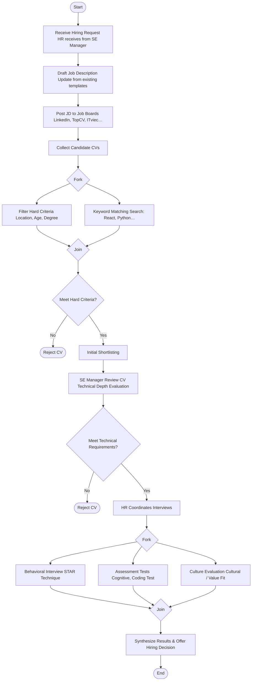
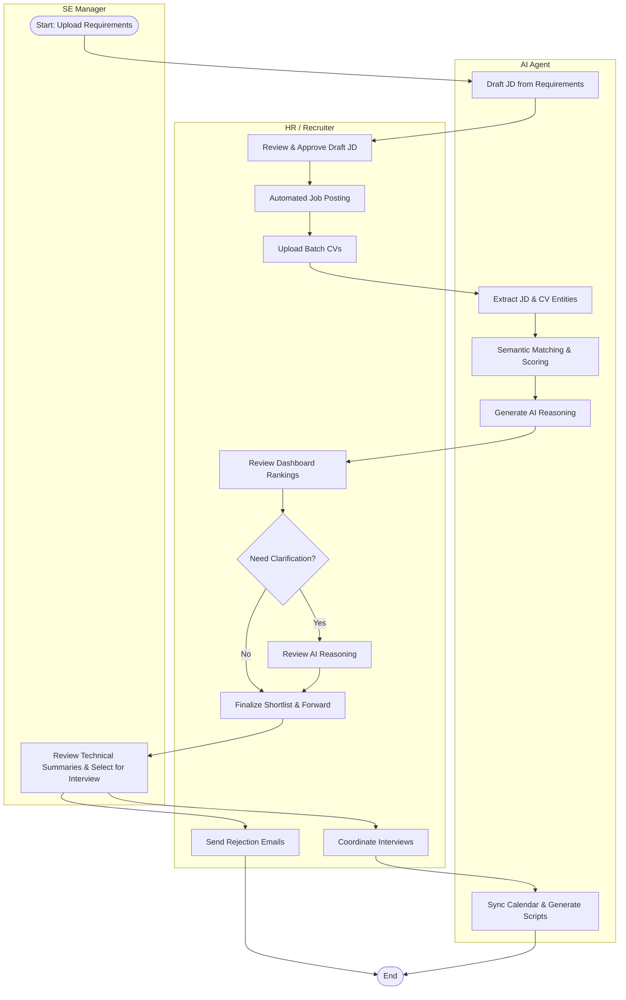
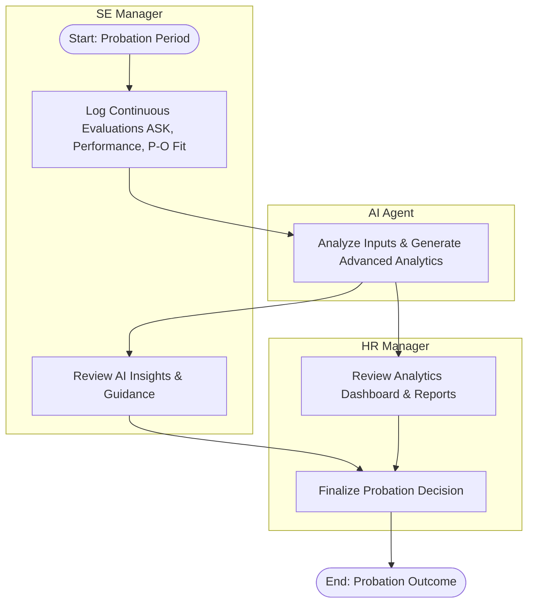

# Business Processes

This section outlines how the recruitment workflow operates, contrasting the current manual state with the automated process enabled by the AI Agent.

## Filter CV Processes

### Current Process (As-is)

The existing workflow is heavily manual and relies on simple keyword matching, often leading to inefficiencies or missed talent.

1.  **JD Preparation**: HR receives talent requirements from the SE Manager and prepares the Job Description, usually by updating existing templates.
2.  **Sourcing**: HR posts the JD on various job boards and collects CVs.
3.  **Basic Screening (Manual)**: HR manually filters hundreds of CVs based on:
    - **Hard Criteria**: Location, age, degree, and years of experience.
    - **Basic Keyword Matching**: Searching for specific terms (e.g., "React", "Python") without understanding the candidate's actual proficiency or project context.
4.  **Initial Shortlisting**: HR selects a broad list (e.g., 20 candidates) based on these surface-level filters.
5.  **Technical Review**: The list is sent to the SE Manager, who must spend time reviewing candidates that may not actually have the required technical depth.
6.  **Interview Coordination**: HR contacts the selected candidates to schedule interviews
    - Behavior Interview, using STAR technique (Situation, Task, Action, Result)
    - Assessment Tests: Cognitive Ability Tests, Work Sample Tests / Coding Tests, Personality Assessments.
    - Cultural Fit / Value Fit

**Pain Points**: High workload for HR, inconsistent screening quality, and "keyword matching" gaps that frustrate technical managers.

### Desired Process (To-be)

The AI Agent transforms the process by introducing semantic understanding, automated JD generation, and streamlined workflows across all modules.

1.  **JD Generation (Module 2)**: SE Manager uploads hiring requirements. The AI Agent automatically drafts a structured Job Description (JD). HR reviews, edits, and approves the final JD (HITL).
2.  **Automated Job Posting (Module 3)**: HR selects recruitment platforms, and the system automatically posts the approved JD.
3.  **CV Input (Module 4)**: HR uploads batch CVs into the AI Agent system for the specific JD.
4.  **Automated Extraction**: The AI Agent identifies mandatory skills, experience levels, and preferred qualifications from the JD.
5.  **Semantic Evaluation (AI-Driven)**:
    - **Parsing**: The LLM extracts education, work history, and project details from CVs.
    - **Matching**: Instead of counting keywords, the AI analyzes the "depth" of experience and alignment with JD requirements.
    - **Scoring & Reasoning**: The AI generates a **Matching Score** and a short summary of **AI Reasoning** (pros/cons) for each candidate.
6.  **Ranked Dashboard (Module 4)**: HR reviews a ranked list of candidates on a dashboard, adjusting classifications if needed (HITL).
7.  **Manager Collaboration**: The SE Manager accesses the system to review the HR-forwarded shortlist, focusing only on the most qualified candidates with the help of AI summaries.
8.  **Rejection & Interview Coordination (Module 5)**:
    - HR triggers automated rejection emails for non-matching candidates.
    - HR schedules interviews, which sync with Google Calendar, and the AI provides appropriate Call Scripts. _(Note: Technical skill tests like coding tests are handled externally and not integrated into this system)._
9.  **Analytics & Reporting (Module 7)**: Hiring Admins review dashboards tracking conversion rates, AI effectiveness, and average Time-to-hire.

### Activity Diagram

The following diagram illustrates the interaction between the stakeholders and the AI Agent across all modules.

## Tracking and Evaluating Personnel

### Evaluation Criteria Frameworks:

1. **Core Competency Criteria (ASK / KSAO Model)**
   This is the most fundamental criteria framework to assess whether an individual is capable of performing the job.

- **Knowledge**: The understanding of theory, professional expertise, and processes. In IT, this includes knowledge of data structures, algorithms, and programming languages.

- **Skills**: The ability to apply knowledge into practice to generate results. Examples: Clean code writing skills, ability to use version control tools (Git).

- **Abilities / Attitude**: Cognitive capacity, logical reasoning, willingness to learn, discipline, and perseverance. Unlike skills that can be learned quickly, abilities and attitudes are more enduring characteristics of an individual.

2. **Performance Criteria (Task vs. Contextual Performance)**
   When evaluating personnel (especially current employees or candidates through practical tests), behavioral psychology theory divides performance into two types:

- **Task Performance**: Evaluates the completion level of tasks explicitly stated in the Job Description (JD). This criterion is often measured by quantity (number of bugs fixed, lines of code) and quality (system optimization level, defect rate). It is typically quantified through KPIs (Key Performance Indicators) or OKRs (Objectives and Key Results) systems.

- **Contextual Performance**: Evaluates behaviors not listed in the JD but that contribute to the psychological and social environment of the organization. Criteria include: proactiveness in helping colleagues, willingness to take on additional tasks, and ability to collaborate (Teamwork).

3. **Person-Organization Fit (P-O Fit) Criteria**
   This is the decisive criterion for whether an employee will stay long-term and maximize their potential at the company.

- **Value Congruence**: Evaluates whether the individual's beliefs and working style align with the company culture (e.g., an individual prefers safety and stability vs. a company that demands innovation and risk-taking).

- **Long-term Goals**: Whether the individual's career destination is aligned with the organization's development roadmap.

### Current Process (As-is)

Currently, tracking and evaluating personnel during probation relies heavily on manual observation and sporadic feedback.
1. **Manual Tracking**: The SE Manager informally observes the candidate's performance and behavior.
2. **Infrequent Feedback**: Feedback is typically given only at the end of the probation period or when critical issues arise.
3. **Subjective Evaluation**: Decisions to pass or fail probation often rely on subjective impressions rather than a structured, data-driven framework.

**Pain Points**: High risk of bias, lack of continuous feedback for candidate improvement, and difficulty for HR to track probation progress holistically.

### Desired Process (To-be)

The AI Agent digitizes and enhances the probation evaluation process by enabling continuous tracking, structured frameworks, and data-driven analytics.
1. **Continuous Input**: The SE Manager regularly logs evaluations and feedback into the system based on the ASK, Performance, and P-O Fit frameworks.
2. **AI Analysis**: The AI Agent continuously monitors these inputs, analyzing task performance, contextual behaviors, and cultural alignment.
3. **Advanced Analytics**: The system utilizes advanced analytics to generate detailed insights, scoring the candidate's performance and providing actionable guidance to the manager.
4. **Comprehensive Reporting**: HR Managers and SE Managers access real-time dashboards and exportable reports to make informed, objective decisions about the candidate's probation outcome (HITL).

### Activity Diagram

The following diagram illustrates the interaction between the stakeholders and the AI Agent during the Probation Tracking & Evaluation phase.

