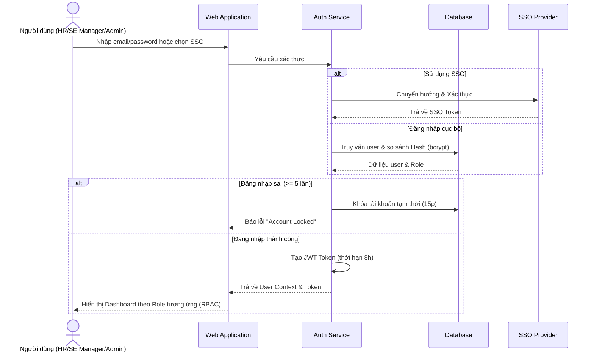
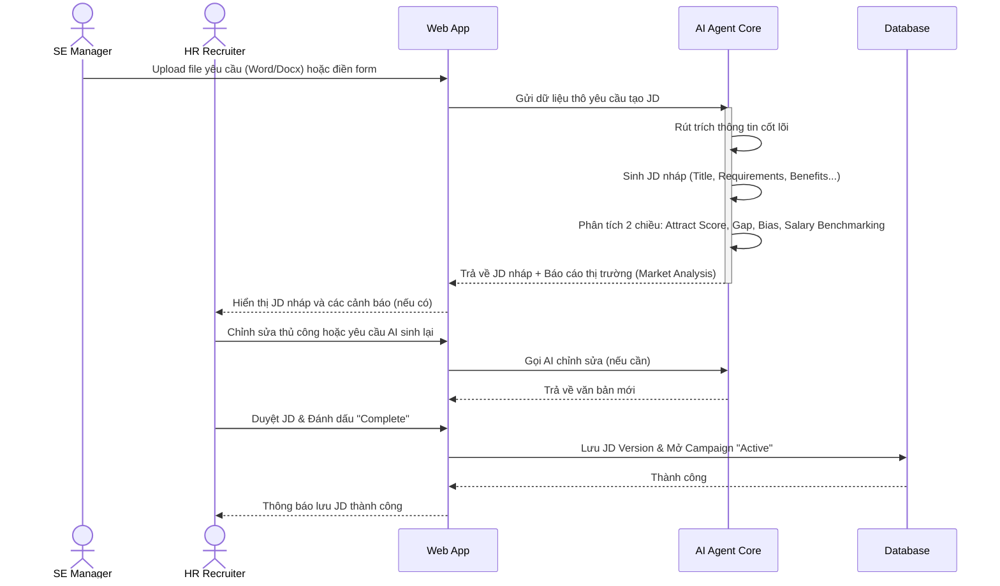
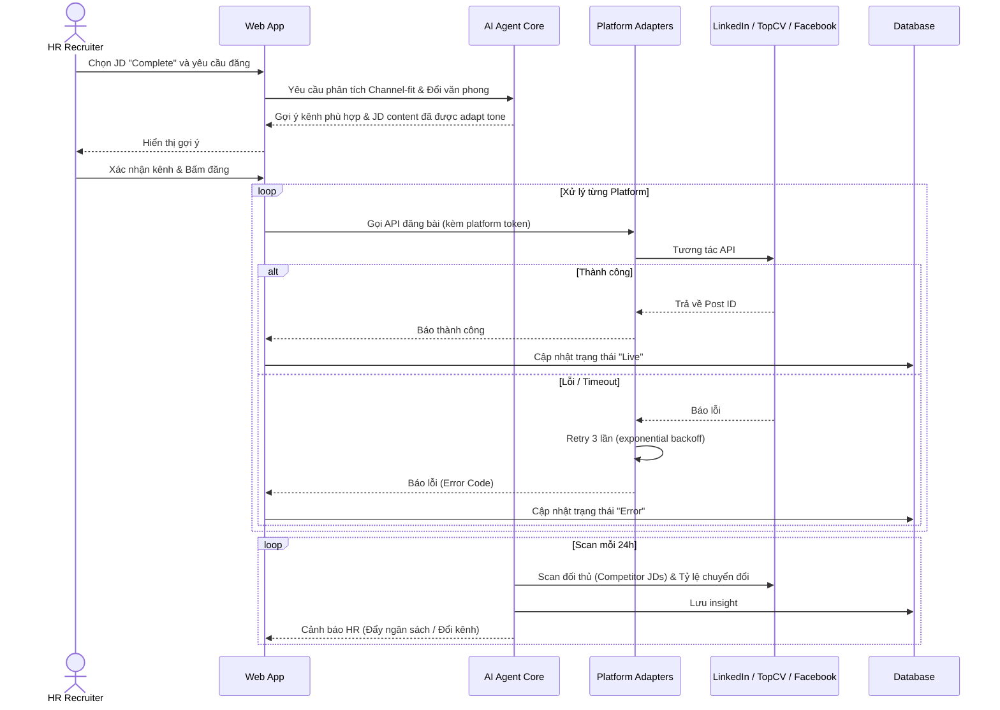
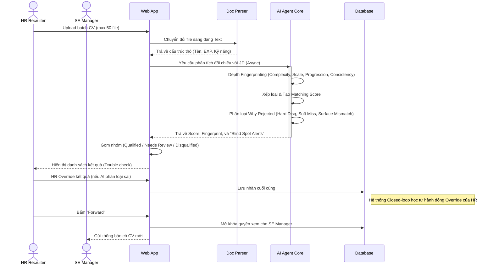
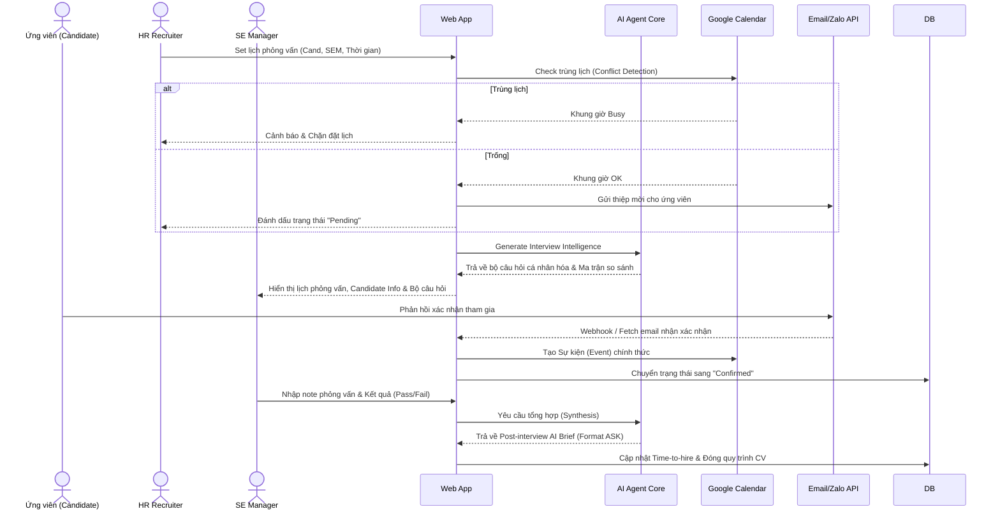
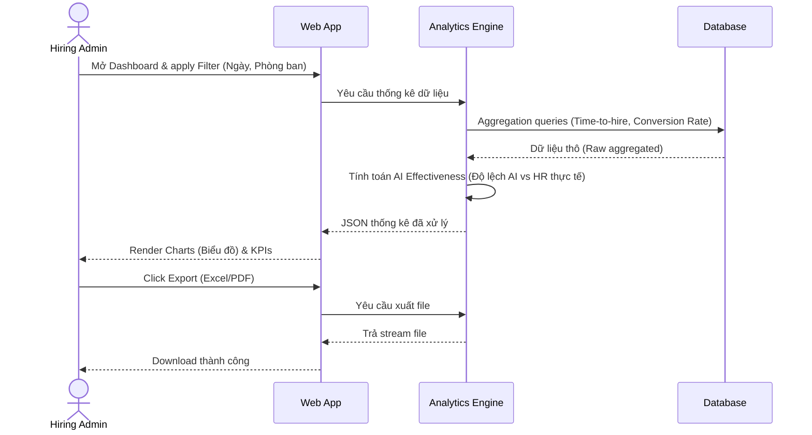
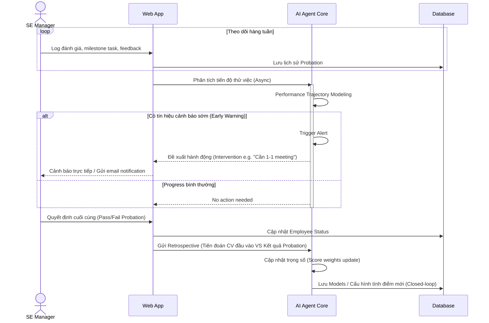

# Specific Requirements

## 1. Authentication & Authorization

### Functional Requirements (FR)

| ID     | Description                                                                                                                                                                                                                                |
| ------ | ------------------------------------------------------------------------------------------------------------------------------------------------------------------------------------------------------------------------------------------ |
| FR-1.1 | The system shall provide login/logout functionality using company accounts (supporting SSO — Single Sign-On if required).                                                                                                                  |
| FR-1.2 | The system shall implement Role-Based Access Control (RBAC) with 4 roles:                                                                                                                                                                  |
|        | — **HR / Recruiter (Primary User):** Upload JDs/CVs, view AI-scored CV lists, forward shortlisted candidates to departments, and manage interview schedules.                                                                               |
|        | — **SE Manager / Hiring Manager (Beneficiary):** Upload job requirements, view shortlisted candidates (received from HR) with AI-generated technical summaries, decide whether to approve/reject, and track candidate interview schedules. |
|        | — **Hiring Admin / HR Manager (Administrator):** View analytics reports on the process: Time-to-hire, conversion rates from CV to successful interview, and evaluate AI Agent effectiveness.                                               |
|        | — **System Admin / IT Support:** Administer system configurations, manage user accounts/permissions.                                                                                                                                       |
| FR-1.3 | The system shall provide an Admin Panel for System Admins to: create/lock/delete accounts, assign/change Roles, and fine-tune AI parameters (prompt templates, model versions, thresholds).                                                |
| FR-1.4 | **Password Reset Flow:** The system shall support password recovery via email. If SSO is mandatory, the password reset process will be handled entirely by the SSO provider (the system will not store or process passwords).              |

### Non-functional Requirements (NFR)

| ID      | Description                                                                                                                                                                                                                           |
| ------- | ------------------------------------------------------------------------------------------------------------------------------------------------------------------------------------------------------------------------------------- |
| NFR-1.1 | **Security:** Passwords must be stored using secure hashing (bcrypt/argon2). Sessions must use Token/JWT with a maximum expiration of 8 hours. CV data and candidate information must be encrypted at rest and in transit (TLS 1.2+). |
| NFR-1.2 | **Performance:** Authentication response time shall be < 2 seconds (P95).                                                                                                                                                             |
| NFR-1.3 | **Availability:** The system shall ensure a minimum uptime of 99.5% (calculated monthly).                                                                                                                                             |
| NFR-1.4 | **Concurrency:** Support at least 50 concurrent login sessions without performance degradation.                                                                                                                                       |

### Business Rules (BR)

| ID     | Description                                                                                                                                 |
| ------ | ------------------------------------------------------------------------------------------------------------------------------------------- |
| BR-1.1 | Only System Admins have the authority to create new users and adjust user roles.                                                            |
| BR-1.2 | Each SE Manager can only view recruitment information, CVs, and interview schedules for campaigns belonging to their respective department. |
| BR-1.3 | Accounts shall be temporarily locked after 5 consecutive failed login attempts; lockout duration is 15 minutes.                             |
| BR-1.4 | **Campaign Creation:** A Recruitment Campaign is automatically created when a JD is marked "Complete" (FR-2). The campaign remains "Active" until explicitly closed. |
| BR-1.5 | **Campaign Closure:** Hiring Admin or HR Manager can close a campaign. Upon closure, all associated job postings are automatically unpublished (FR-3.4). |
| BR-1.6 | **Data Archival:** Upon campaign closure, JD and CV data are moved to "Archived" state. Archived data is retained for 12 months then permanently deleted. Archived data is read-only. |

### Sequence Diagram

---

## 2. JD Analysis & Generation

### Functional Requirements (FR)

| ID     | Description                                                                                                                                                                                                                                              |
| ------ | -------------------------------------------------------------------------------------------------------------------------------------------------------------------------------------------------------------------------------------------------------- |
| FR-2.1 | SE Managers shall upload internal requirement documents (Word/PDF) or fill out a preliminary requirement form. Uploaded requirement files are limited to **10MB per file**.                                                                              |
| FR-2.2 | The AI Agent shall automatically analyze input requirements and draft/generate a structured, professional Job Description (JD) (including: Job Title, Job Description, Mandatory Requirements, Preferred Requirements, Benefits).                        |
| FR-2.3 | HR shall receive the draft JD from AI and can: (a) Use the AI Agent to further rewrite/edit each section, or (b) manually edit via the editor — especially for compensation, benefits, and company culture (areas SE Managers may not be familiar with). |
| FR-2.4 | The system shall maintain Version History for every JD edit, allowing for comparison and rollback if necessary.                                                                                                                                          |
| FR-2.5 | **Bi-directional JD Intelligence:** The AI shall evaluate the draft JD against the market to provide: **(a) Attract Score** (predicts application rate), **(b) Requirement Gap Detection** (finds contradictions), **(c) Bias Audit** (flags exclusionary language), and **(d) Salary Benchmarking** (alerts if salary deviates >15% from real-time market data). |

### Non-functional Requirements (NFR)

| ID      | Description                                                                                                                                                                                                           |
| ------- | --------------------------------------------------------------------------------------------------------------------------------------------------------------------------------------------------------------------- |
| NFR-2.1 | **UI/UX:** The JD editor must support a side-by-side comparison mode between the original SE Manager requirements and the AI-generated content. The interface must be responsive for resolutions of 1280px and above. |
| NFR-2.2 | **Performance:** The AI shall return JD generation results within < 10 seconds (P95, measured at ≤ 10 concurrent users).                                                                                              |
| NFR-2.3 | **Timeout Threshold:** If the AI model does not return a JD response within **15 seconds**, the request is considered timed out and ERR-2 is triggered.                                                               |

### Business Rules (BR)

| ID     | Description                                                                                                                              |
| ------ | ---------------------------------------------------------------------------------------------------------------------------------------- |
| BR-2.1 | Any AI-generated JD must undergo manual review by HR (HITL — Human In The Loop) before being marked as "Complete" and ready for posting. |
| BR-2.2 | JDs in "Draft" status shall not be used for any automated posting or CV matching features within the system.                             |
| BR-2.3 | **JD Quality Feedback Loop:** After campaigns close, the system shall assign a "JD Quality Score" based on the ratio of technical rejections; frequently rejected JDs will be flagged for mandatory review to improve criteria in future campaigns. |

### Sequence Diagram

---

## 3. Automated Job Posting

### Functional Requirements (FR)

| ID     | Description                                                                                                                                                                                                                                                                |
| ------ | -------------------------------------------------------------------------------------------------------------------------------------------------------------------------------------------------------------------------------------------------------------------------- |
| FR-3.1 | HR shall select a "Complete" (approved) JD and choose the recruitment platforms for posting from a list configured by the System Admin (e.g., LinkedIn, TopCV, ITviec, Facebook Groups...).                                                                                |
| FR-3.2 | The system shall automatically post the approved JD to the selected platforms. Each post shall record a status: **Processing → Success / Failure**.                                                                                                                        |
| FR-3.3 | The system shall track the status of each post on every platform in real-time, including: **Live / Expired / Taken Down**. HR can view a Dashboard summarizing the status of all posts.                                                                                    |
| FR-3.4 | **Active Unpublish:** HR shall be able to manually take down posted JDs (e.g., when the position is filled). The status will then update to "Taken Down" on the Dashboard and the listing will be removed from the platform.                                               |
| FR-3.5 | In case of posting failure (API error, timeout, authentication error), the system shall automatically retry up to **3 times** with exponential backoff: **30s → 60s → 120s**. After 3 failures, the system marks the status as "Error" and notifies HR with an error code. |
| FR-3.6 | The system shall record detailed logs for each platform API call (request/response) for troubleshooting purposes.                                                                                                                                                          |
| FR-3.7 | **Agentic Channel Intelligence:** Based on JD attributes (role, seniority, tech stack), the AI shall recommend the most suitable recruitment platforms (Channel-fit Analysis) and automatically adapt the tone of the JD to fit each specific platform.                  |
| FR-3.8 | **Market & Performance Monitoring:** The AI shall track competitor JDs for market comparison. It shall also track posting conversion rates after 3-5 days to recommend boosting budget or switching channels.                                                            |

### Non-functional Requirements (NFR)

| ID      | Description                                                                                                                                                                                            |
| ------- | ------------------------------------------------------------------------------------------------------------------------------------------------------------------------------------------------------ |
| NFR-3.1 | **Scalability:** The architecture for recruitment platform integration must follow an Adapter/Plugin model, allowing for new platform connectors to be added without changing the core business logic. |
| NFR-3.2 | **Reliability:** The internal system success rate for posting (excluding third-party platform errors) shall be >= 99%.                                                                                 |
| NFR-3.3 | **Credential Security:** All OAuth tokens and API keys for third-party platforms must be stored encrypted (AES-256) in a dedicated secret store, never in plaintext in the DB/code.                     |
| NFR-3.4 | **Least Privilege:** Tokens must be scoped with minimum required permissions. Token expiry and rotation are managed by the System Admin.                                                               |

### Business Rules (BR)

| ID     | Description                                                                                                                                                                                                                                                                          |
| ------ | ------------------------------------------------------------------------------------------------------------------------------------------------------------------------------------------------------------------------------------------------------------------------------------ |
| BR-3.1 | Only JDs with "Complete" status (approved by HR) are permitted for automated posting.                                                                                                                                                                                                |
| BR-3.2 | When a third-party platform changes its API/format (e.g., LinkedIn schema change), the System Admin is responsible for updating the corresponding Adapter. The system shall alert the System Admin if continuous errors are detected on a specific platform (>= 5 errors in 1 hour). |
| BR-3.3 | HR is not allowed to post the same JD to the same platform more than once within a 24-hour period (to prevent spam).                                                                                                                                                                 |
| BR-3.4 | **Access Control:** Only System Admin has access to view or modify platform credentials. HR cannot see raw tokens.                                                                                                                                                                   |
| BR-3.5 | **Token Expiry:** If a token expires mid-operation, the system shall abort, mark as "Auth Error", and notify System Admin. Platform will be set to "Inactive" until refreshed.                                                                                                       |
### Sequence Diagram

---

## 4. CV Semantic Analysis & Scoring

### Functional Requirements (FR)

| ID     | Description                                                                                                                                                                                                                                                                                                         |
| ------ | ------------------------------------------------------------------------------------------------------------------------------------------------------------------------------------------------------------------------------------------------------------------------------------------------------------------- |
| FR-4.1 | HR shall upload CVs in batches (PDF/Word format). Upload limits: **Maximum 5MB per file** and **maximum 50 files per batch**. The Agent shall automatically parse information: Name, Contact, Education, Work Experience, Projects, Skills.                                                                         |
| FR-4.2 | The Agent shall evaluate CVs using **Depth Fingerprinting**, analyzing 4 dimensions to bypass simple keyword matching: **Complexity Signals, Scale Signals, Progression Signals, and Consistency Signals**. Output shall include a "Technical Fingerprint", Matching Score, and Detailed Analysis Table.            |
| FR-4.3 | The system shall automatically categorize CVs into 3 groups based on Score: **Qualified / Needs Review / Disqualified**.                                                                                                                                                                                            |
| FR-4.4 | HR shall review all results (Double Check — HITL) and can override categorization labels (e.g., moving a CV from "Disqualified" to "Needs Review"). Once finalized, HR clicks "Forward" to send the approved list to the Hiring Admin and SE Manager.                                                               |
| FR-4.5 | When the same CV is evaluated against different JDs, the system shall create a separate evaluation for each CV-JD pair (scores are not shared between JDs).                                                                                                                                                         |
| FR-4.6 | **"Why Rejected" Explainability Engine:** The AI shall explicitly classify rejection reasons into a Taxonomy (Hard Disqualifier, Soft Miss, Surface Mismatch) to prevent false negatives.                                                                                                                           |
| FR-4.7 | **Second Chance & Blind Spot Alerts:** CVs with strong backgrounds but poor presentation (Surface Mismatch) shall be flagged as "Needs closer look". The AI shall alert SE Managers to "Blind spots" where HR might have mistakenly filtered out qualified candidates due to missing keywords.                      |

### Non-functional Requirements (NFR)

| ID      | Description                                                                                                                                                                                                                                           |
| ------- | ----------------------------------------------------------------------------------------------------------------------------------------------------------------------------------------------------------------------------------------------------- |
| NFR-4.1 | **Performance (Batch Processing):** The system shall handle at least 50 CVs in 1 batch without blocking the UI (async processing). Completion time for scoring 50 CVs shall be < 5 minutes (P95, under normal load of ≤ 5 concurrent batch requests). |
| NFR-4.2 | **UI/UX:** Display a real-time Progress Bar for the current processing batch. The Dashboard shall provide quick filters by: score level, category label, and key skills.                                                                              |
| NFR-4.3 | **Timeout Threshold:** If the AI model does not return a scoring result for a single CV within **60 seconds**, that CV is marked as "Scoring Failed" and the user is notified; processing continues for the rest.                                                                     |

### Business Rules (BR)

| ID     | Description                                                                                                                                                                                                                                                                  |
| ------ | ---------------------------------------------------------------------------------------------------------------------------------------------------------------------------------------------------------------------------------------------------------------------------- |
| BR-4.1 | **Scoring Scale:** Matching Score uses a 0–100 scale. Scores are weighted: Mandatory Skills (40%), Experience & Projects (30%), Preferred Skills (20%), Other factors like Education/Certifications (10%). Default weights can be adjusted by the System Admin per campaign. |
| BR-4.2 | **Categorization Thresholds:** Score >= 70 → "Qualified", 40-69 → "Needs Review", < 40 → "Disqualified". These thresholds are adjustable by the System Admin.                                                                                                                |
| BR-4.3 | **Consistency:** When the same CV is re-scored against the same JD (unchanged content), the score variance shall not exceed ±5 points. The System Admin can configure LLM temperature = 0 for higher determinism.                                                            |
| BR-4.4 | SE Managers cannot access the candidate list until HR completes the Double Check and clicks "Forward".                                                                                                                                                                       |
| BR-4.5 | Scores are references to support decision-making. AI does not make the final hiring decision — that authority remains with human users (HITL).                                                                                                                               |
| BR-4.6 | **Closed-loop System (Override Learning):** When HR overrides AI categorization and the candidate performs better/worse later, the system shall learn from this human judgement to warn HR of biases or adjust its own future predictions.                                   |

### Sequence Diagram

---

## 5. Rejection & Interview Coordination

### Functional Requirements (FR)

| ID     | Description                                                                                                                                                                                                                                                                               |
| ------ | ----------------------------------------------------------------------------------------------------------------------------------------------------------------------------------------------------------------------------------------------------------------------------------------- |
| FR-5.1 | HR shall be able to select (singly or in bulk) "Disqualified" candidates and send rejection emails using a default template. Templates can be customized by HR before sending.                                                                                                            |
| FR-5.2 | For candidates selected for an interview, the system shall support sending invitations via: **(a)** Email (template), **(b)** Zalo message (template), **(c)** Providing an AI-generated **Call Script** dynamically based on the candidate's personal profile/skills relative to the JD. |
| FR-5.3 | HR shall input and set interview schedules (selecting candidate, time slot, room/meeting link, and participating SE Manager).                                                                                                                                                             |
| FR-5.4 | Interview schedules shall be synced bi-directionally with Google Calendar. Hiring Admins and SE Managers can view a Calendar View (Day / Week / Month) on the system to arrange their participation.                                                                                      |
| FR-5.5 | **Reschedule:** When a schedule change is needed (requested by candidate or SE Manager), HR shall edit the schedule on the system. The system automatically notifies all stakeholders (candidate, SE Manager, Hiring Admin) via email and updates Google Calendar.                        |
| FR-5.6 | **Automated Reminders:** The system shall send reminder emails to candidates and interviewers 24 hours prior to the interview.                                                                                                                                                            |
| FR-5.7 | **Recording Interview Results:** The system shall require a final interview result (Pass/Fail/On Hold). HR or the SE Manager will input this data to close the cycle and directly update the Time-to-hire report (Module 7).                                                            |
| FR-5.8 | **SE Manager Schedule View:** SE Managers shall have a dedicated view showing upcoming interviews assigned to them, with status (Pending/Confirmed/Cancelled), candidate name, and meeting link. "Pending" labels are visible but unconfirmed.                                       |
| FR-5.9 | **SE Manager Interview Intelligence:** The AI shall automatically generate Personalized Interview Questions targeted at the specific candidate's weaknesses or areas needing verification based on their CV.                                                                          |
| FR-5.10| **Candidate Comparison Matrix:** The system shall provide a multi-dimensional comparison matrix side-by-side for shortlisted candidates based on JD criteria to help SE Managers make final hiring decisions.                                                                         |
| FR-5.11| **Post-interview AI Brief:** After an interview, the AI shall synthesize the SE Manager's raw feedback into a structured report (e.g., ASK model - Attitude, Skill, Knowledge) to save in the candidate's profile for HR use.                                                         |

### Non-functional Requirements (NFR)

| ID      | Description                                                                                                                              |
| ------- | ---------------------------------------------------------------------------------------------------------------------------------------- |
| NFR-5.1 | **Email Speed:** Ensure sending speed does not exceed 30 emails/minute/domain to avoid spam filters. Use asynchronous processing queues. |
| NFR-5.2 | **UI/UX:** The Calendar View must be clear with Day / Week / Month modes and responsive from 1280px.                                     |
| NFR-5.3 | **Calendar Sync:** Sync latency between the system and Google Calendar shall be < 30 seconds.                                            |

### Business Rules (BR)

| ID     | Description                                                                                                                                                                                                                                                                                   |
| ------ | --------------------------------------------------------------------------------------------------------------------------------------------------------------------------------------------------------------------------------------------------------------------------------------------- |
| BR-5.1 | **Conflict Detection:** The system shall check for schedule conflicts based on real-time Google Calendar data for the SE Manager. If the chosen slot overlaps with a "Busy" event, the system shall warn HR and prevent booking.                                                              |
| BR-5.2 | **Confirmation Process:** Interview schedules only transition to "Confirmed" status after HR confirms with the candidate (via Call, Zalo, or Email response). Before confirmation, the schedule is "Pending"; SE Managers can view it, but it is not pushed to the official Calendar.         |
| BR-5.3 | **Non-response Handling:** If a candidate does not confirm within 48 hours of initial contact, the system automatically sends a follow-up email. If there is still no response after another 24 hours, the candidate is marked as "Non-responsive", and HR is notified for manual processing. |
| BR-5.4 | **Cancellation:** When a schedule is cancelled, the system shall notify all stakeholders and update Google Calendar.                                                                                                                                                                          |
| BR-5.5 | **Out of Scope (Coding Test / Assessments):** Technical skill tests, coding tests, or IQ/EQ assessments are handled externally by the SE Manager or third-party tools. The system does not natively generate, grade, or integrate with these assessments.                                     |

### Sequence Diagram

---

## 6. Error Handling & Fallback

This section applies **system-wide** to all modules using AI (Sections 2 & 4) and third-party integrations (Sections 3 & 5).

### General Exception Handling Rules

| ID    | Scenario                                                                     | System Behavior                                                                                                                                                                                                             |
| ----- | ---------------------------------------------------------------------------- | --------------------------------------------------------------------------------------------------------------------------------------------------------------------------------------------------------------------------- |
| ERR-1 | **AI returns empty response**                                                | Display a clear error message: "AI could not analyze this content. Please try again or input manually." Log the error for Admin review. Allow users to perform the task manually (manual JD input or manual CV evaluation). |
| ERR-2 | **AI timeout**                                                               | Automatically retry once if threshold is reached (15s for JD, 60s per CV). If it still timeouts, notify user and allow: (a) try again later, or (b) switch to manual mode.                                                   |
| ERR-3 | **AI returns invalid result** (wrong format, score out of range, irrelevant) | Validate output before returning to user. If invalid, retry up to 2 times. If error persists, log input/output for Admin troubleshoot and allow manual override.                                                            |
| ERR-4 | **Third-party integration error** (Google Calendar/Zalo API failure)         | Display a specific error message (e.g., "Cannot sync Google Calendar, please check your connection"). The system shall still allow HR to create internal schedules and sync them later once the connection is restored.     |
| ERR-5 | **File upload error** (corrupt, wrong format, size limit exceeded)           | Refuse the file immediately with a specific error message (e.g., "Invalid format. Only PDF/Word supported" or "File exceeds limit"). Do not pass the file to the AI pipeline.                                               |

### Non-functional Requirements (NFR)

| ID      | Description                                                                                                                                                                                                                                                                          |
| ------- | ------------------------------------------------------------------------------------------------------------------------------------------------------------------------------------------------------------------------------------------------------------------------------------ |
| NFR-6.1 | **Logging & Data Retention:** All system errors (AI, integration, upload) must be logged and stored for **up to 90 days**. Logs containing Personally Identifiable Information (PII) must be masked or deleted after **30 days** to ensure compliance with regulations (e.g., PDPA). |
| NFR-6.2 | **Monitoring:** System Admins shall have a dedicated dashboard to track AI error rates, average latency, and connection status for third-party services.                                                                                                                             |
| NFR-6.3 | **Graceful Degradation:** If an AI feature fails, the rest of the system must remain functional. Users must always have a manual fallback option.                                                                                                                                    |

---

## 7. Analytics & Reporting

### Functional Requirements (FR)

| ID     | Description                                                                                                                                                                                                   |
| ------ | ------------------------------------------------------------------------------------------------------------------------------------------------------------------------------------------------------------- |
| FR-7.1 | The system shall provide a Dashboard with KPI cards: Total CVs processed, Qualified/Disqualified counts, overall conversion rate, and average Time-to-hire per campaign.                                       |
| FR-7.2 | Hiring Admins shall be able to filter analytics by: date range, department, specific JD, and campaign status.                                                                                                 |
| FR-7.3 | The system shall support exporting analytics reports (Charts and Tables) to PDF or CSV format.                                                                                                                |
| FR-7.4 | **AI Effectiveness Metric:** Display a comparison between AI initial score and final human categorization (HITL override rate) to evaluate model precision.                                                   |

### Non-functional Requirements (NFR)

| ID      | Description                                                                                                                              |
| ------- | ---------------------------------------------------------------------------------------------------------------------------------------- |
| NFR-7.1 | **Performance:** Analytics dashboard shall load within **< 3 seconds** (P95) for data ranges up to 6 months.                             |
| NFR-7.2 | **Accuracy:** KPI calculations must be updated in near real-time (latency < 5 minutes from data entry).                                  |

### Business Rules (BR)

| ID     | Description                                                                                                                                                                    |
| ------ | ------------------------------------------------------------------------------------------------------------------------------------------------------------------------------ |
| BR-7.1 | **Data Access:** Only Hiring Admin and System Admin roles can access aggregate organization-wide Analytics. HR and SE Managers are restricted to their assigned campaigns only. |
| BR-7.2 | **Time-to-hire Logic:** This metric is measured from the date a JD is marked "Complete" (FR-2) to the date an interview result "Pass" is recorded (FR-5.7).                      |

### Sequence Diagram

---

## 8. Probation Tracking & Evaluation

### Functional Requirements (FR)

| ID     | Description                                                                                                                                                                                                                                                                                                                                     |
| ------ | ----------------------------------------------------------------------------------------------------------------------------------------------------------------------------------------------------------------------------------------------------------------------------------------------------------------------------------------------- |
| FR-8.1 | SE Managers shall be able to track and input continuous performance evaluations and behaviors for candidates during their probation period directly into the system.                                                                                                                                                                            |
| FR-8.2 | **Probation Early Warning System:** The AI shall perform Performance Trajectory Modeling to draw progress curves rather than snapshot scoring, predicting success probabilities over time.                                                                                                                                                    |
| FR-8.3 | **Early Warning Triggers & Intervention:** The AI shall detect risk signals (e.g., manager stops logging feedback, performance drops) and proactively recommend specific interventions (e.g., "Schedule a 1-on-1 focused on X").                                                                                                            |
| FR-8.4 | The system shall generate and export comprehensive reports on the candidate's performance, suitability, and behaviors to help HR Managers and SE Managers continuously evaluate the candidate throughout the probation period.                                                                                                                  |
| FR-8.5 | **Retrospective Closed-loop Learning:** Upon probation completion (pass/fail), the AI shall compare the final outcome with its initial CV screening predictions and Interview results to automatically update and optimize the scoring weights for future recruitment.                                                                        |

### Non-functional Requirements (NFR)

| ID      | Description                                                                                                                                                                 |
| ------- | --------------------------------------------------------------------------------------------------------------------------------------------------------------------------- |
| NFR-8.1 | **Data Security:** Probation evaluation data must be stored securely with strict access control, visible only to the associated SE Manager, HR Manager, and System Admin. |
| NFR-8.2 | **Analytics Performance:** Generation of advanced analytics reports must complete within < 5 seconds (P95).                                                               |

### Business Rules (BR)

| ID     | Description                                                                                                                                                                                |
| ------ | ------------------------------------------------------------------------------------------------------------------------------------------------------------------------------------------ |
| BR-8.1 | The AI Agent acts as an analytical assistant; final decisions regarding the candidate's probation status (e.g., pass, fail, or extend probation) remain the responsibility of human managers. |

### Sequence Diagram
