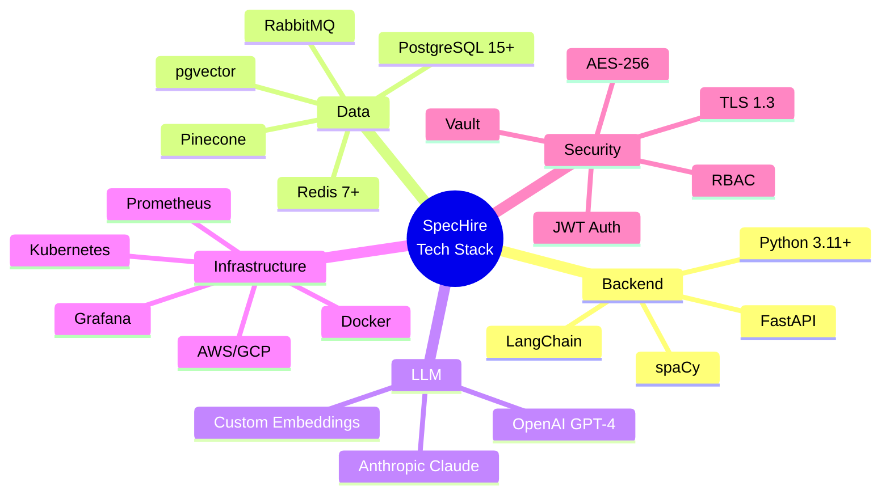
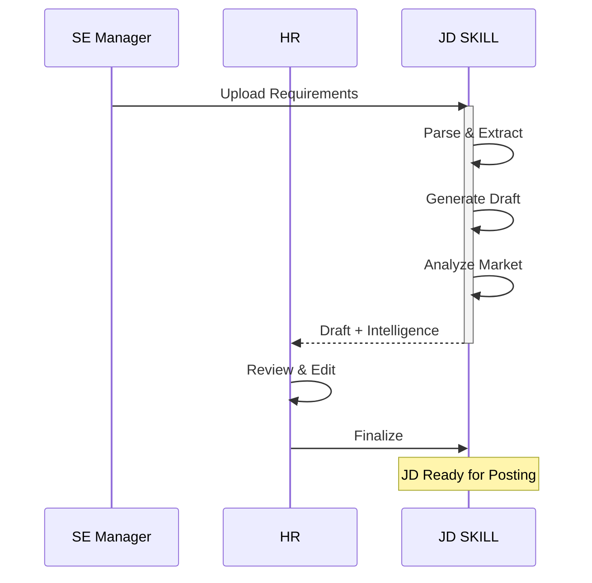
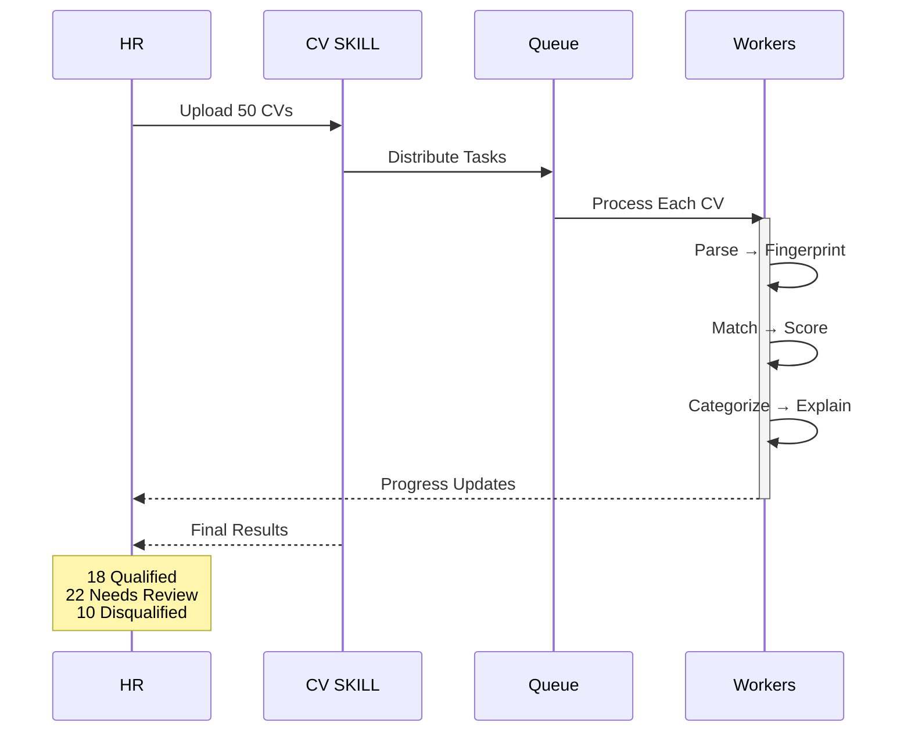
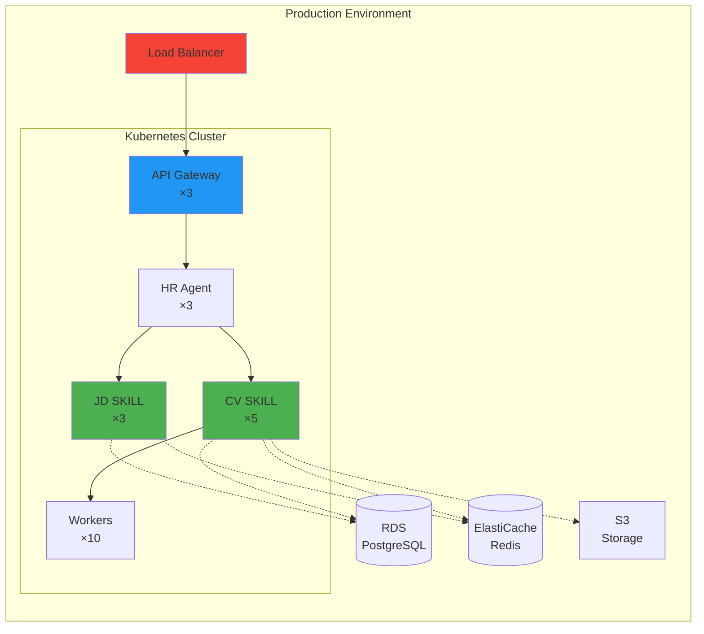
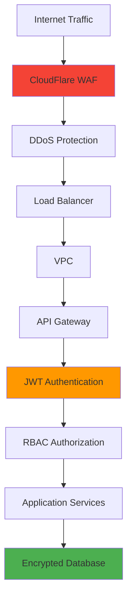
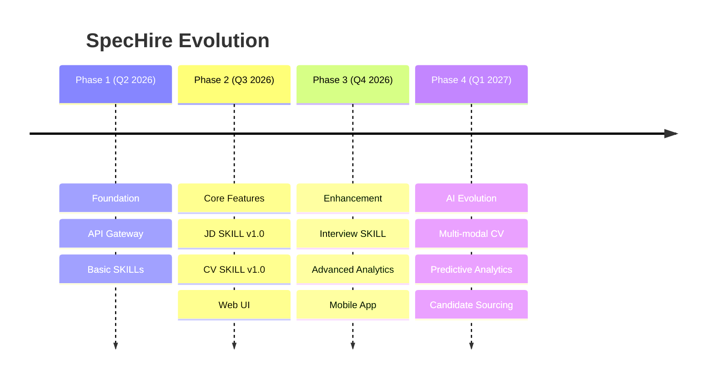

# Architecture Visual Summary
## One-Page Architecture Overview

---

## System Architecture - Single View

```mermaid
graph TB
    subgraph "Users"
        U1[HR Recruiter]
        U2[SE Manager]
        U3[HR Admin]
    end
    
    subgraph "Presentation Layer"
        UI[Web Application<br/>React/Vue]
    end
    
    subgraph "API Layer"
        API[API Gateway<br/>FastAPI<br/>Auth + Routing]
    end
    
    subgraph "Orchestration Layer"
        ORCH[HR Agent Orchestrator<br/>Intent Classification<br/>Context Management<br/>SKILL Routing]
    end
    
    subgraph "SKILL Layer - Core Intelligence"
        JD[JD Analysis SKILL<br/>━━━━━━━━━━━━━━━━<br/>📄 Parse Requirements<br/>✏️ Generate JD<br/>📊 Attract Score<br/>🔍 Gap Detection<br/>⚖️ Bias Audit<br/>💰 Salary Benchmark]
        
        CV[CV Semantic Analysis SKILL<br/>━━━━━━━━━━━━━━━━<br/>📑 Batch Processing<br/>🔬 Depth Fingerprinting<br/>├─ Complexity Signals<br/>├─ Scale Signals<br/>├─ Progression Signals<br/>└─ Consistency Signals<br/>🎯 Semantic Matching<br/>💡 Explainable Scoring<br/>🚨 Blind Spot Detection]
    end
    
    subgraph "Integration Layer"
        LLM[LLM Gateway<br/>OpenAI | Anthropic]
        EXT[External APIs<br/>Job Boards | Salary | Calendar]
    end
    
    subgraph "Data Layer"
        DB[(PostgreSQL<br/>+ pgvector)]
        CACHE[(Redis<br/>Cache)]
        QUEUE[RabbitMQ<br/>Queue]
        S3[S3<br/>Storage]
        VECTOR[(Pinecone<br/>Vector DB)]
    end
    
    U1 --> UI
    U2 --> UI
    U3 --> UI
    UI --> API
    API --> ORCH
    
    ORCH --> JD
    ORCH --> CV
    
    JD --> LLM
    CV --> LLM
    JD --> EXT
    
    JD --> DB
    CV --> DB
    JD --> CACHE
    CV --> CACHE
    CV --> QUEUE
    CV --> S3
    CV --> VECTOR
    
    style JD fill:#4CAF50,stroke:#2E7D32,stroke-width:3px
    style CV fill:#2196F3,stroke:#1565C0,stroke-width:3px
    style ORCH fill:#FF9800,stroke:#E65100,stroke-width:2px
    style LLM fill:#9C27B0,stroke:#6A1B9A,stroke-width:2px
```

---

## SKILL Capability Matrix

| Capability | JD Analysis SKILL | CV Analysis SKILL |
|-----------|-------------------|-------------------|
| **Primary Function** | Generate job descriptions | Score and match candidates |
| **Input** | Requirements doc/form | Batch of CVs (PDF/Word) |
| **Processing** | LLM generation + Intelligence | Depth fingerprinting + Matching |
| **Output** | JD draft + Market analysis | Scored CVs + Explanations |
| **Latency** | < 10s (P95) | < 5min for 50 CVs |
| **Key Innovation** | Bi-directional intelligence | Beyond keyword matching |
| **Learning** | Quality feedback from campaigns | HR overrides + hire outcomes |

---

## Technology Stack Overview



---

## Data Flow - JD Creation (Simplified)



---

## Data Flow - CV Analysis (Simplified)



---

## Deployment Topology



---

## Security Layers



---

## Key Metrics Dashboard

### JD Analysis SKILL
```
┌─────────────────────────────────────────┐
│ JD Generation Latency (P95)            │
│ ▓▓▓▓▓▓▓▓░░ 8.2s / 10s target          │
├─────────────────────────────────────────┤
│ Attract Score Distribution              │
│ High (70-100): ████████ 32%            │
│ Med (40-69):   ████████████ 48%        │
│ Low (0-39):    ████ 20%                │
├─────────────────────────────────────────┤
│ Bias Alerts Triggered                   │
│ Age: 15 | Gender: 8 | Cultural: 3      │
└─────────────────────────────────────────┘
```

### CV Analysis SKILL
```
┌─────────────────────────────────────────┐
│ Batch Processing (50 CVs)              │
│ ▓▓▓▓▓▓▓▓▓░ 4.5min / 5min target       │
├─────────────────────────────────────────┤
│ Categorization Accuracy                 │
│ Agreement with SE: ████████ 87%        │
├─────────────────────────────────────────┤
│ False Negative Reduction                │
│ Before: 23% | After: ████ 8%           │
├─────────────────────────────────────────┤
│ Blind Spot Alerts                       │
│ This Week: 12 alerts → 8 hired         │
└─────────────────────────────────────────┘
```

---

## Scaling Strategy

### Horizontal Scaling
```
Normal Load         Peak Load (3x)
┌─────────┐        ┌─────────┐
│ API ×3  │  ────> │ API ×9  │
│ JD  ×3  │        │ JD  ×6  │
│ CV  ×5  │        │ CV  ×15 │
│ Work×10 │        │ Work×30 │
└─────────┘        └─────────┘
   Auto-scaling based on:
   • CPU utilization > 70%
   • Queue depth > 30
   • Request rate > threshold
```

---

## Future Roadmap



---

## Quick Reference

### API Endpoints
```
POST   /api/jd/analyze          - Create JD
GET    /api/jd/{id}             - Get JD
POST   /api/cv/analyze/batch    - Analyze CVs
GET    /api/cv/batch/{id}       - Get batch status
POST   /api/cv/override         - Record HR override
```

### Key Configuration
```yaml
# JD SKILL
latency_target: 10s
llm_model: gpt-4-turbo
temperature: 0.7

# CV SKILL
batch_size: 50
worker_count: 10
timeout_per_cv: 60s
score_threshold:
  qualified: 70
  needs_review: 40
```

### Environment Variables
```bash
SKILL_VERSION=1.0.0
LLM_API_KEY=sk-...
DATABASE_URL=postgresql://...
REDIS_URL=redis://...
RABBITMQ_URL=amqp://...
```

---

## Contact & Support

| Purpose | Contact |
|---------|---------|
| **Architecture Questions** | #architecture-review |
| **Implementation Support** | #platform-support |
| **Bug Reports** | #bug-reports |
| **Feature Requests** | #feature-requests |

---

**Last Updated:** 2026-03-26  
**Version:** 1.0  
**Status:** ✅ Ready for Implementation
