# SpecHire System Architecture
## HR SKILL - JD Analysis & CV Semantic Scoring

**Version:** 1.0  
**Date:** 2026-03-26  
**Status:** Design Phase

---

## Table of Contents
1. [Architecture Overview](#1-architecture-overview)
2. [System Context](#2-system-context)
3. [High-Level Architecture](#3-high-level-architecture)
4. [Component Architecture](#4-component-architecture)
5. [Data Architecture](#5-data-architecture)
6. [Integration Architecture](#6-integration-architecture)
7. [Deployment Architecture](#7-deployment-architecture)
8. [Security Architecture](#8-security-architecture)

---

## 1. Architecture Overview

### 1.1 Architecture Principles

| Principle | Description | Impact |
|-----------|-------------|--------|
| **Modularity** | SKILL-based architecture with loosely coupled components | Easy to extend and maintain |
| **Scalability** | Horizontal scaling for compute-intensive operations | Handle growing user base |
| **Observability** | Comprehensive logging, metrics, and tracing | Fast troubleshooting |
| **Security First** | Defense in depth, encryption, RBAC | Protect sensitive HR data |
| **Human-in-the-Loop** | AI assists but humans decide | Maintain accountability |
| **Explainability** | All AI decisions are transparent | Build trust and compliance |

### 1.2 Key Quality Attributes

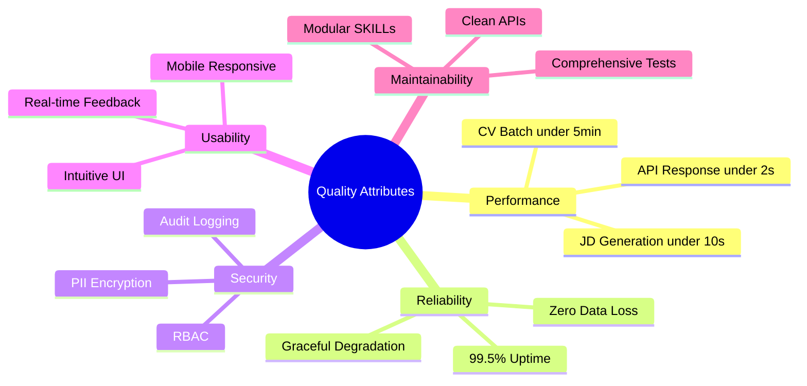

---

## 2. System Context

### 2.1 Context Diagram

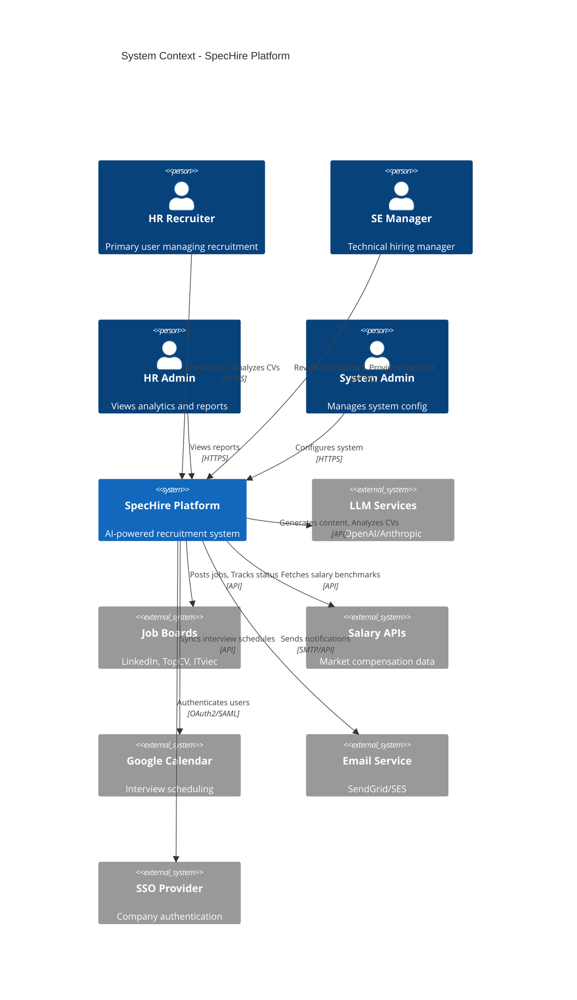

### 2.2 User Roles & Interactions

| Role | Primary Actions | Key Interactions |
|------|----------------|------------------|
| **HR Recruiter** | Upload JDs, Analyze CVs, Schedule interviews | JD SKILL, CV SKILL, Interview Manager |
| **SE Manager** | Submit requirements, Review candidates, Interview | JD Input, Candidate Review, Feedback |
| **HR Admin** | View analytics, Monitor campaigns | Reporting Dashboard, Analytics Engine |
| **System Admin** | Configure AI, Manage users, System settings | Admin Panel, SKILL Config |

---

## 3. High-Level Architecture

### 3.1 Layered Architecture

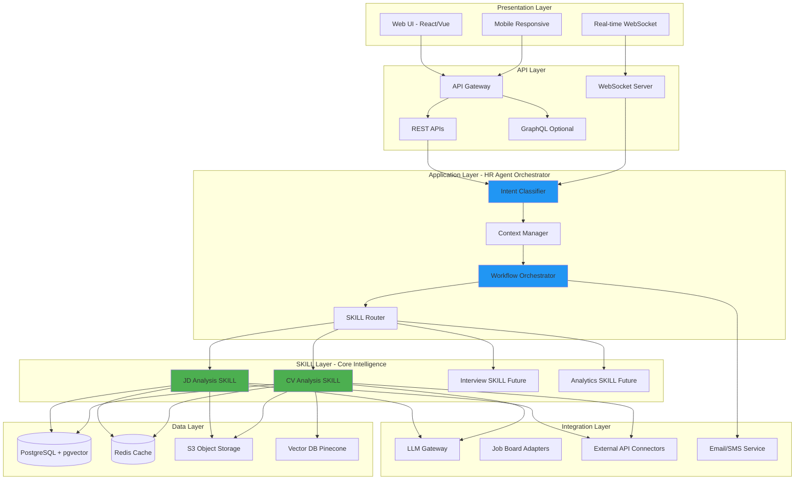

### 3.2 Architecture Patterns

#### Pattern 1: SKILL-Based Architecture
```
┌─────────────────────────────────────────┐
│         HR Agent Orchestrator           │
│  (Coordinates workflows & context)      │
└────────────┬────────────────────────────┘
             │
    ┌────────┴────────┐
    │   SKILL Router   │
    │  (Discovers &    │
    │   invokes SKILLs)│
    └────────┬────────┘
             │
   ┌─────────┴─────────────┐
   │                       │
┌──▼──────────┐    ┌──────▼───────┐
│  JD SKILL   │    │  CV SKILL    │
│  ┌────────┐ │    │  ┌─────────┐ │
│  │Parser  │ │    │  │Parser   │ │
│  │Generator│ │    │  │Finger-  │ │
│  │Intel   │ │    │  │printer  │ │
│  └────────┘ │    │  │Matcher  │ │
│             │    │  └─────────┘ │
└─────────────┘    └──────────────┘
```

**Benefits:**
- Independent development & deployment
- Reusable across different contexts
- Easy to test in isolation
- Can be versioned independently

#### Pattern 2: Event-Driven Processing
```
User Action → Event Bus → SKILL Processing → Results
     │                         │
     └─── Real-time ───────────┘
         Progress Updates
```

#### Pattern 3: CQRS for Analytics
```
Write Model:                Read Model:
JD/CV Operations  ──→  Event Store  ──→  Analytics Views
                              │
                              └──→  Reporting DB
```

---

## 4. Component Architecture

### 4.1 JD Analysis SKILL - Detailed Architecture

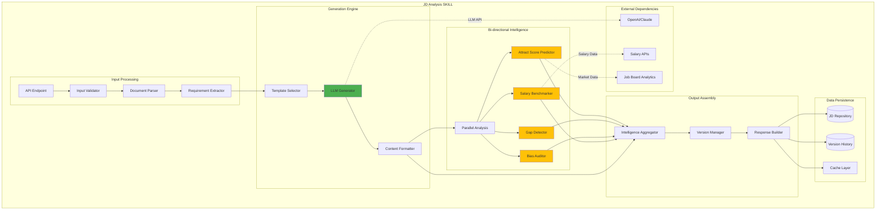

**Component Responsibilities:**

| Component | Responsibility | Technology |
|-----------|---------------|------------|
| **Document Parser** | Extract text from Word/PDF | python-docx, PyPDF2, pytesseract |
| **Requirement Extractor** | NLP to identify key requirements | spaCy, transformers |
| **LLM Generator** | Generate professional JD content | LangChain + GPT-4/Claude |
| **Attract Score Predictor** | ML model to predict application rate | Custom trained model |
| **Gap Detector** | Logic to find contradictions | Rule engine + LLM |
| **Bias Auditor** | Scan for discriminatory language | Pattern matching + LLM |
| **Salary Benchmarker** | Real-time salary comparison | External API integration |

### 4.2 CV Semantic Analysis SKILL - Detailed Architecture

```mermaid
graph TB
    subgraph "CV Analysis SKILL"
        subgraph "Batch Processing"
            A[Batch Upload API] --> B[File Validator]
            B --> C[Queue Manager]
            C --> D[Parallel Worker Pool]
        end
        
        subgraph "CV Processing Pipeline"
            D --> E[Document Parser]
            E --> F[Structure Extractor]
            F --> G[Entity Recognizer]
        end
        
        subgraph "Depth Fingerprinting Engine"
            G --> H[Fingerprint Orchestrator]
            H --> I[Complexity Analyzer]
            H --> J[Scale Analyzer]
            H --> K[Progression Analyzer]
            H --> L[Consistency Analyzer]
            
            I --> M[Technical Fingerprint]
            J --> M
            K --> M
            L --> M
        end
        
        subgraph "Matching & Scoring"
            M --> N[JD Requirements Loader]
            N --> O[Semantic Matcher]
            O --> P[Score Calculator]
            P --> Q[Auto-Categorizer]
        end
        
        subgraph "Explainability"
            Q --> R[Why Rejected Engine]
            R --> S[Blind Spot Detector]
            S --> T[Explanation Generator]
        end
        
        subgraph "Results & Learning"
            T --> U[Results Aggregator]
            U --> V[Batch Results DB]
            U --> W[Real-time Progress]
            
            X[HR Override Tracker] --> Y[Closed-loop Learner]
            Y --> H
        end
        
        subgraph "External Dependencies"
            E -.->|OCR| Z[Tesseract]
            O -.->|Embeddings| AA[Vector DB]
            I -.->|LLM Analysis| AB[OpenAI/Claude]
        end
    end
    
    style I fill:#9C27B0
    style J fill:#9C27B0
    style K fill:#9C27B0
    style L fill:#9C27B0
    style R fill:#FF5722
    style S fill:#FF5722
```

**Component Responsibilities:**

| Component | Responsibility | Technology |
|-----------|---------------|------------|
| **Queue Manager** | Async batch processing | RabbitMQ/Celery |
| **Document Parser** | Multi-format CV parsing | Textract, PyPDF2 |
| **Structure Extractor** | Identify CV sections | Custom NLP + patterns |
| **Complexity Analyzer** | Evaluate technical depth | LLM + heuristics |
| **Scale Analyzer** | Extract quantitative metrics | Regex + NER |
| **Progression Analyzer** | Career trajectory analysis | Timeline analysis |
| **Consistency Analyzer** | Domain focus & stability | Graph analysis |
| **Semantic Matcher** | Deep CV-JD matching | Embeddings + cosine similarity |
| **Why Rejected Engine** | Explainable rejection reasons | Taxonomy classifier |
| **Blind Spot Detector** | Find false negatives | ML model + rules |

### 4.3 HR Agent Orchestrator Architecture

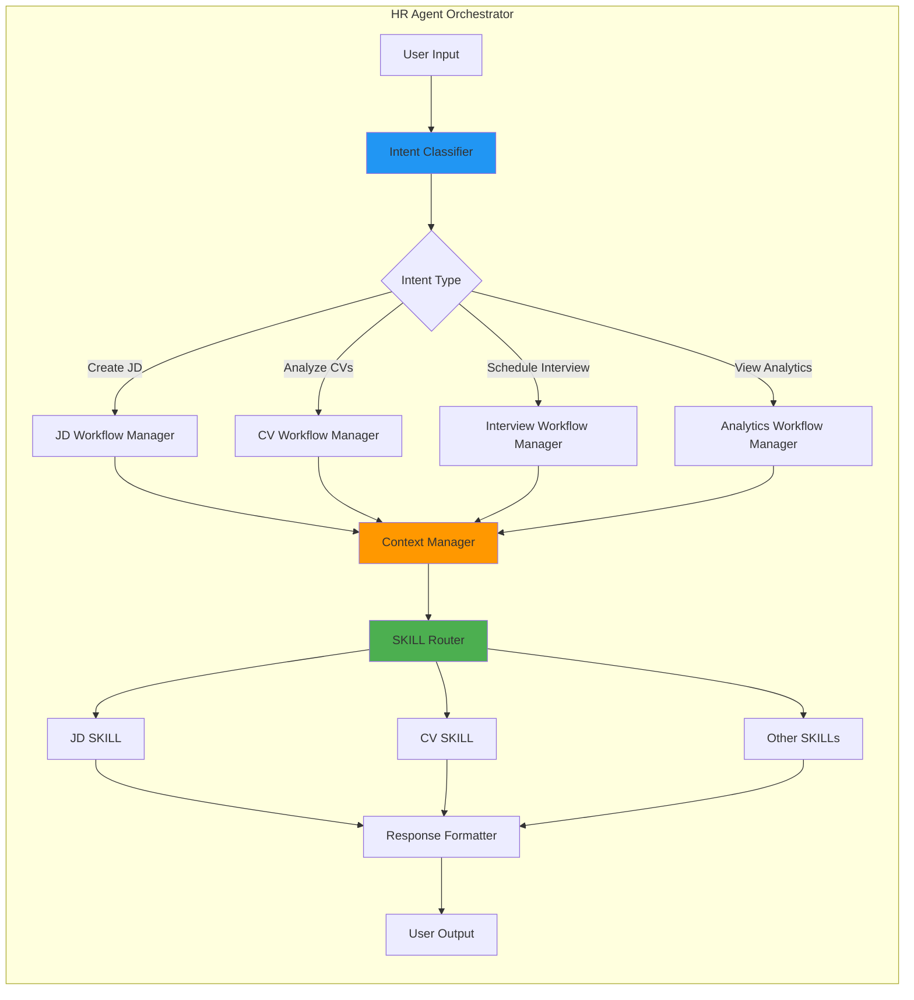

**Orchestrator Responsibilities:**
1. **Intent Classification** - Understand user goals from natural language
2. **Context Management** - Maintain conversation state, user preferences, campaign context
3. **SKILL Routing** - Select and invoke appropriate SKILLs
4. **Workflow Coordination** - Manage multi-step processes
5. **Response Formatting** - Present results in user-friendly format

---

## 5. Data Architecture

### 5.1 Database Schema - Core Entities

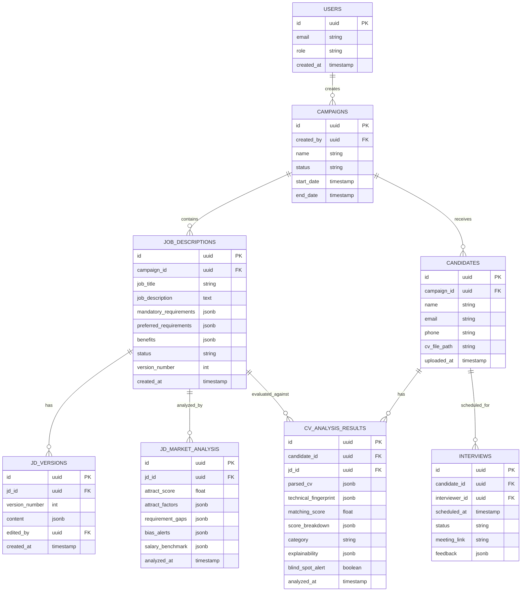

### 5.2 Data Flow Architecture

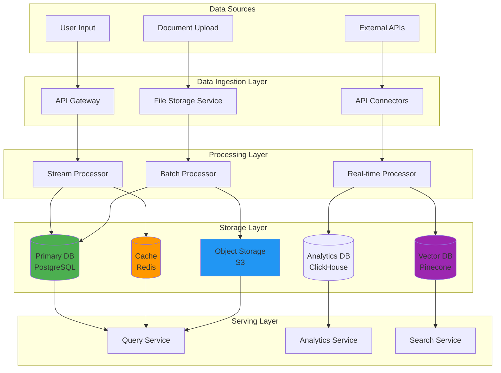

### 5.3 Data Partitioning Strategy

**Campaign-based Partitioning:**
```sql
-- Partition JD and CV data by campaign
CREATE TABLE cv_analysis_results (
    id UUID PRIMARY KEY,
    campaign_id UUID NOT NULL,
    candidate_id UUID NOT NULL,
    -- ... other fields
) PARTITION BY HASH (campaign_id);

-- Archive old campaigns
-- Campaigns > 12 months → Archive DB (read-only)
```

**Benefits:**
- Better query performance (scan only relevant partitions)
- Easy archival (drop old partitions)
- Parallel processing (process partitions independently)

---

## 6. Integration Architecture

### 6.1 Integration Patterns

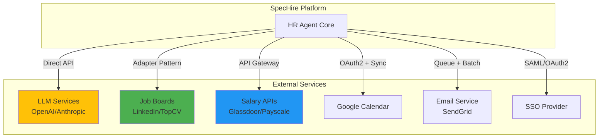

### 6.2 Integration Components

#### LLM Gateway (Unified LLM Access)
```
┌─────────────────────────────────────┐
│         LLM Gateway                 │
│  ┌────────────────────────────┐    │
│  │  Provider Abstraction      │    │
│  │  - OpenAI (GPT-4)         │    │
│  │  - Anthropic (Claude)     │    │
│  │  - Azure OpenAI           │    │
│  └────────────────────────────┘    │
│  ┌────────────────────────────┐    │
│  │  Features:                 │    │
│  │  - Retry & Circuit Breaker│    │
│  │  - Rate Limiting          │    │
│  │  - Cost Tracking          │    │
│  │  - Fallback Strategy      │    │
│  └────────────────────────────┘    │
└─────────────────────────────────────┘
```

#### Job Board Adapter (Plugin Architecture)
```
┌─────────────────────────────────────┐
│     Job Board Adapter Manager       │
│  ┌────────┐  ┌────────┐  ┌───────┐ │
│  │LinkedIn│  │ TopCV  │  │ITviec │ │
│  │Adapter │  │Adapter │  │Adapter│ │
│  └────────┘  └────────┘  └───────┘ │
│                                     │
│  Common Interface:                  │
│  - post_job()                      │
│  - get_status()                    │
│  - unpublish_job()                 │
│  - get_analytics()                 │
└─────────────────────────────────────┘
```

### 6.3 API Integration Matrix

| Service | Protocol | Auth | Rate Limit | SLA | Fallback |
|---------|----------|------|------------|-----|----------|
| OpenAI GPT-4 | REST | API Key | 10K TPM | 99.9% | Claude |
| Anthropic Claude | REST | API Key | Custom | 99.9% | GPT-4 |
| LinkedIn | OAuth2 | OAuth2 | 100/day | 99% | Manual post |
| Google Calendar | REST | OAuth2 | 10K/day | 99.9% | Local cache |
| SendGrid | REST | API Key | 100/sec | 99.95% | AWS SES |
| Salary APIs | REST | API Key | 1K/day | 95% | Cached data |

---

## 7. Deployment Architecture

### 7.1 Kubernetes Deployment Architecture

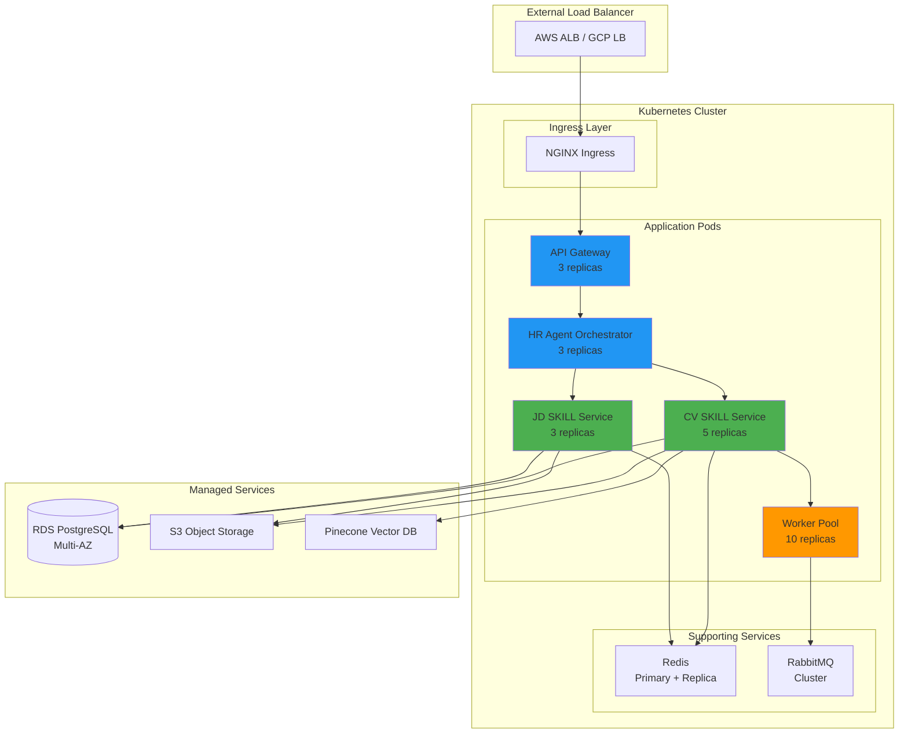

### 7.2 Environment Architecture

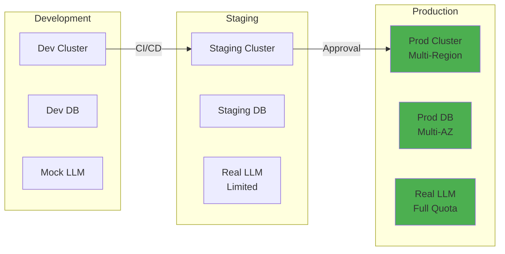

### 7.3 Scaling Strategy

#### Horizontal Pod Autoscaler (HPA)
```yaml
# CV SKILL Service (CPU + Queue-based)
apiVersion: autoscaling/v2
kind: HorizontalPodAutoscaler
metadata:
  name: cv-skill-hpa
spec:
  scaleTargetRef:
    apiVersion: apps/v1
    kind: Deployment
    name: cv-skill-service
  minReplicas: 3
  maxReplicas: 20
  metrics:
  - type: Resource
    resource:
      name: cpu
      target:
        type: Utilization
        averageUtilization: 70
  - type: External
    external:
      metric:
        name: rabbitmq_queue_messages
      target:
        type: AverageValue
        averageValue: "30"
```

#### Vertical Pod Autoscaler (VPA)
```yaml
# JD SKILL Service (Memory optimization)
apiVersion: autoscaling.k8s.io/v1
kind: VerticalPodAutoscaler
metadata:
  name: jd-skill-vpa
spec:
  targetRef:
    apiVersion: apps/v1
    kind: Deployment
    name: jd-skill-service
  updatePolicy:
    updateMode: "Auto"
```

---

## 8. Security Architecture

### 8.1 Security Layers

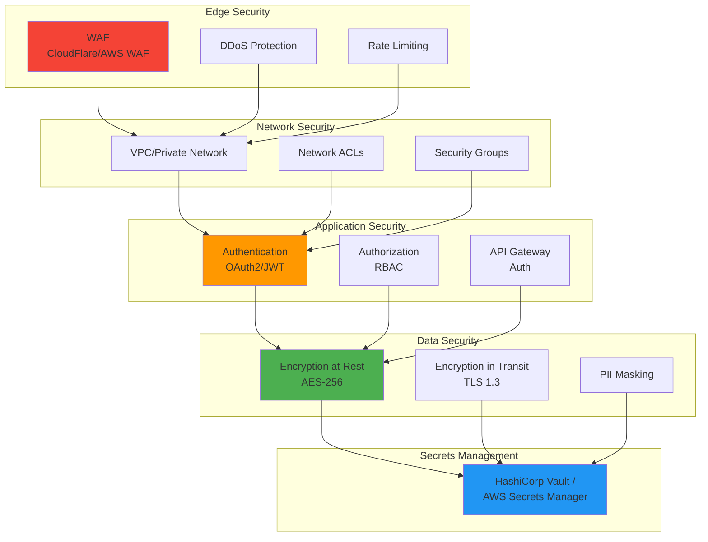

### 8.2 Authentication & Authorization Flow

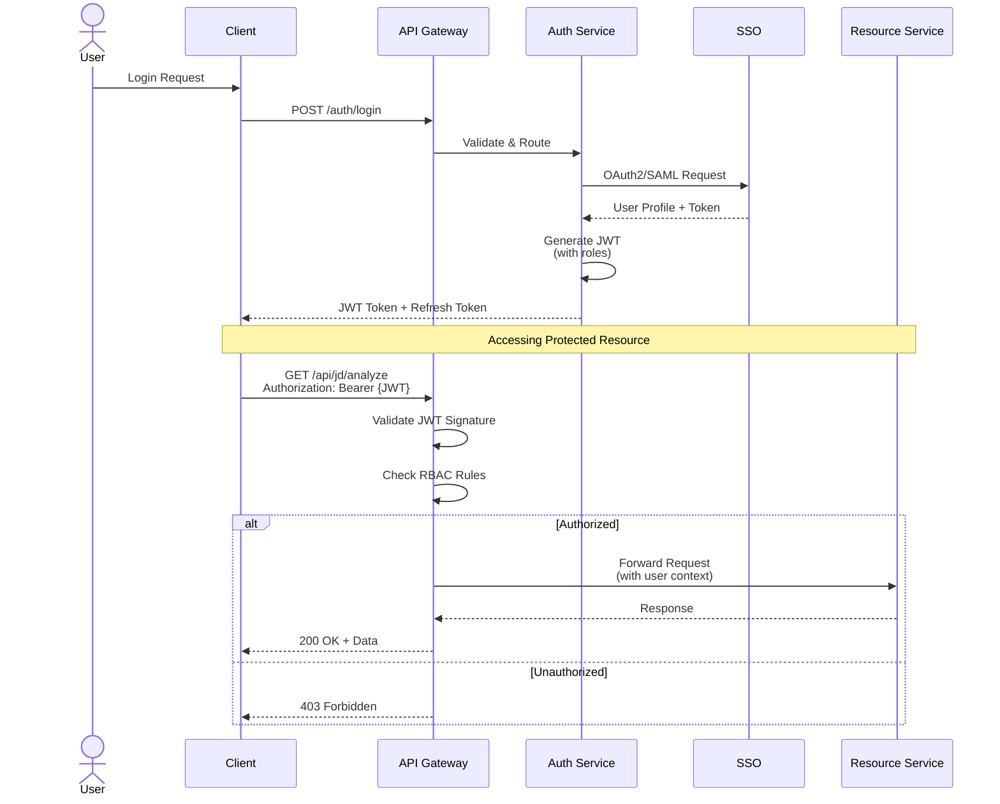

### 8.3 RBAC Model

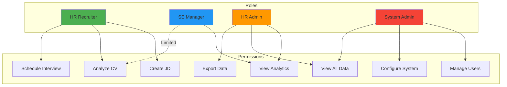

### 8.4 Data Encryption Strategy

| Data Type | At Rest | In Transit | Key Management | Retention |
|-----------|---------|------------|---------------|-----------|
| **CV Files** | AES-256 (S3 SSE-KMS) | TLS 1.3 | AWS KMS | 12 months |
| **PII (Name, Email, Phone)** | Database-level encryption | TLS 1.3 | Vault | 12 months |
| **JD Content** | Standard DB encryption | TLS 1.3 | RDS encryption | Indefinite |
| **API Keys/Secrets** | Vault encryption | TLS 1.3 | Vault | Rotated 90 days |
| **Session Tokens** | Redis encryption | TLS 1.3 | App-level | 8 hours |
| **Audit Logs** | S3 Glacier encryption | TLS 1.3 | AWS KMS | 7 years |

### 8.5 Security Monitoring

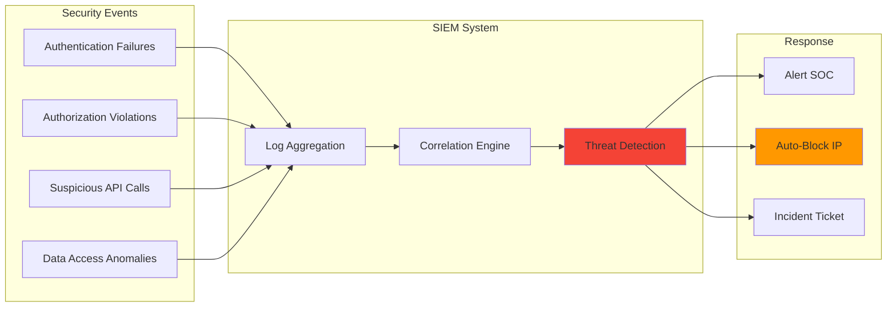

---

## 9. Architecture Decision Records (ADRs)

### ADR-001: SKILL-Based Architecture
**Status:** Accepted  
**Context:** Need modular, reusable AI capabilities  
**Decision:** Implement SKILL-based architecture with HR Agent orchestrator  
**Consequences:** 
- ✅ Independent development and scaling
- ✅ Easy to test and maintain
- ❌ Additional orchestration complexity

### ADR-002: Postgres + pgvector for Storage
**Status:** Accepted  
**Context:** Need relational data + vector similarity search  
**Decision:** Use PostgreSQL with pgvector extension  
**Consequences:**
- ✅ Single database for structured + vector data
- ✅ ACID transactions
- ❌ May need specialized vector DB at scale

### ADR-003: Async Batch Processing for CVs
**Status:** Accepted  
**Context:** CV analysis can take 30-60s per CV  
**Decision:** Use RabbitMQ + Worker pool for async processing  
**Consequences:**
- ✅ Non-blocking UI
- ✅ Horizontal scaling
- ❌ Need progress tracking mechanism

### ADR-004: LLM Gateway Abstraction
**Status:** Accepted  
**Context:** Multiple LLM providers (OpenAI, Anthropic)  
**Decision:** Create unified LLM Gateway with provider abstraction  
**Consequences:**
- ✅ Easy to switch providers
- ✅ Cost optimization via routing
- ❌ Additional abstraction layer

### ADR-005: Kubernetes for Deployment
**Status:** Accepted  
**Context:** Need auto-scaling, resilience, multi-environment  
**Decision:** Deploy on Kubernetes (AWS EKS / GCP GKE)  
**Consequences:**
- ✅ Auto-scaling and self-healing
- ✅ Easy multi-region deployment
- ❌ Operational complexity

---

## 10. Next Steps

### Phase 1: Foundation (Weeks 1-4)
- [ ] Setup development environment
- [ ] Implement basic API Gateway
- [ ] Create PostgreSQL schema
- [ ] Setup CI/CD pipeline

### Phase 2: Core SKILLs (Weeks 5-10)
- [ ] Implement JD Analysis SKILL
- [ ] Implement CV Semantic Analysis SKILL
- [ ] Setup LLM Gateway
- [ ] Integrate async processing

### Phase 3: Orchestration (Weeks 11-14)
- [ ] Build HR Agent Orchestrator
- [ ] Implement SKILL Router
- [ ] Create Context Manager
- [ ] Build Web UI

### Phase 4: Integration & Testing (Weeks 15-18)
- [ ] Integrate external services
- [ ] Performance testing
- [ ] Security audit
- [ ] User acceptance testing

### Phase 5: Deployment (Weeks 19-20)
- [ ] Production environment setup
- [ ] Data migration
- [ ] Training & documentation
- [ ] Go-live

---

**Document Control:**
- **Owner:** Architecture Team
- **Review Cycle:** Quarterly
- **Last Updated:** 2026-03-26
- **Next Review:** 2026-06-26
