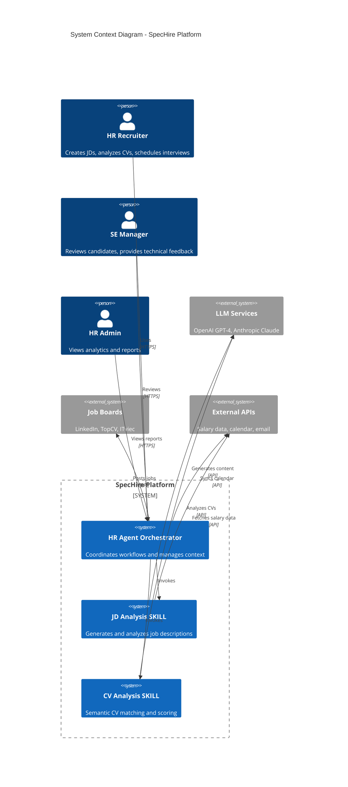
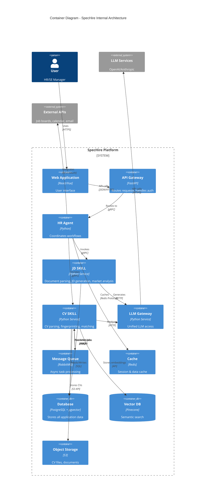
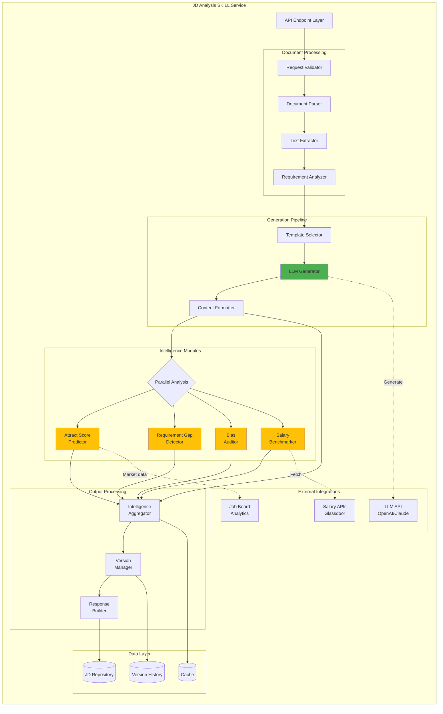
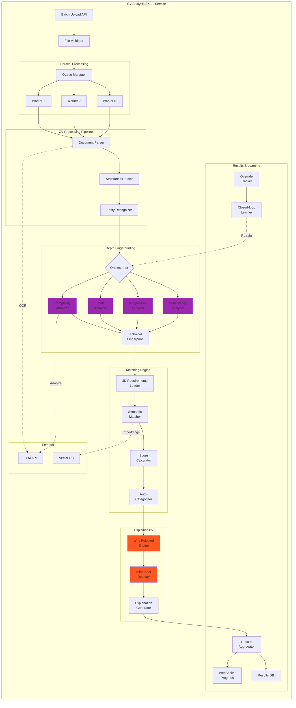
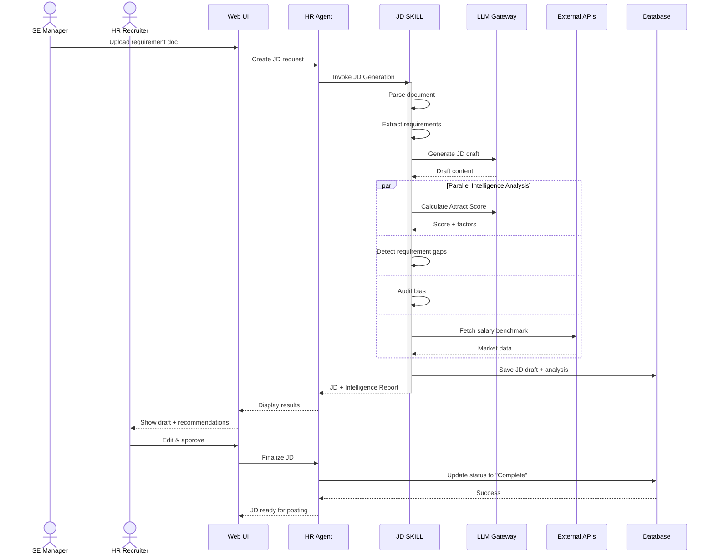
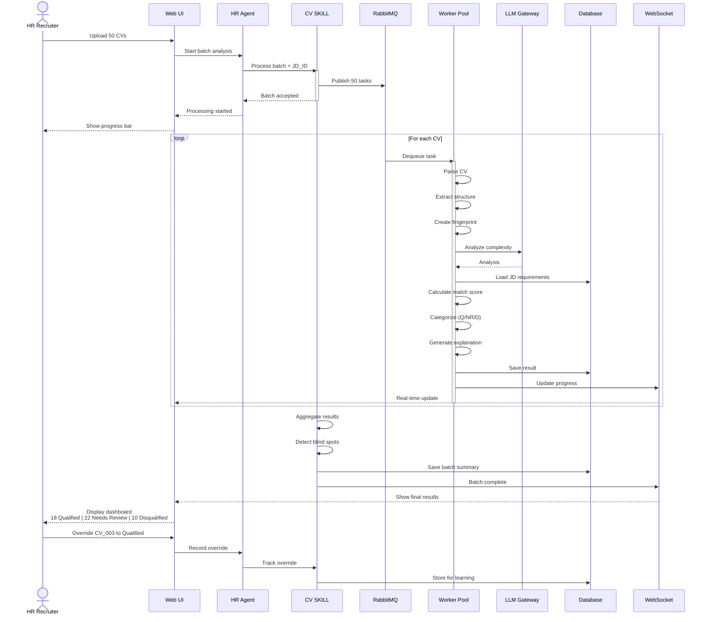
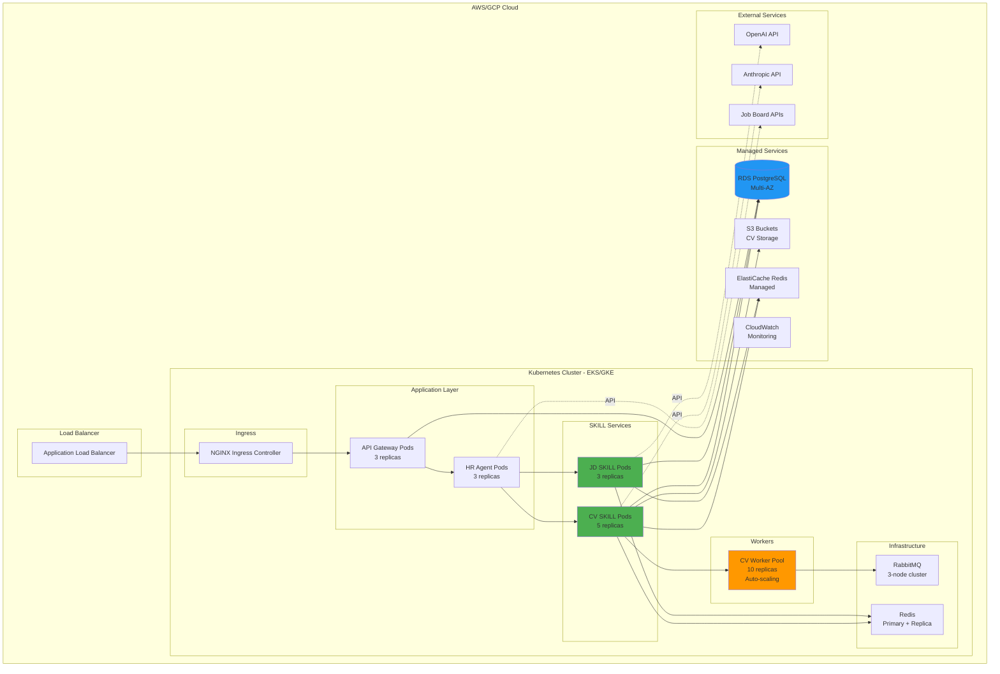
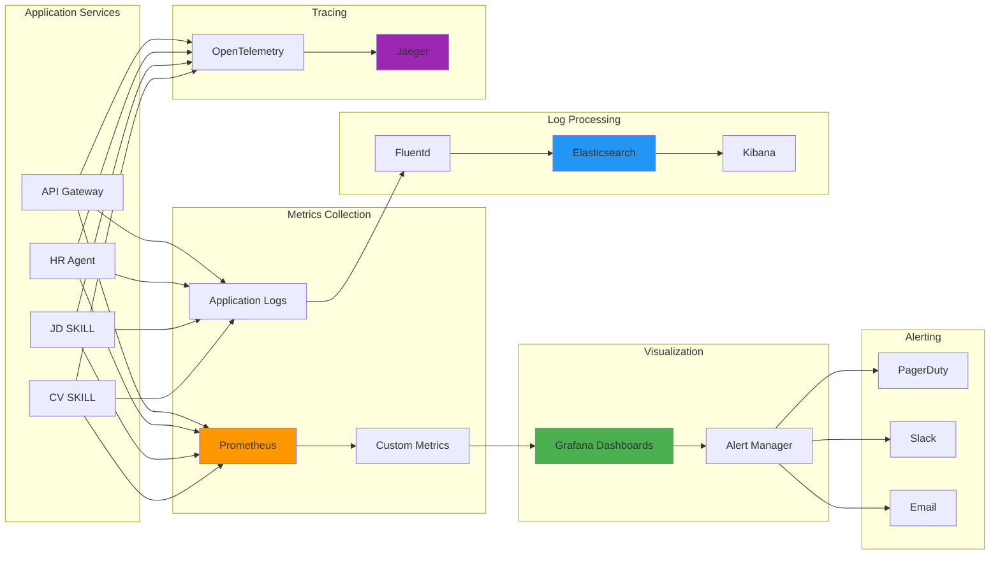
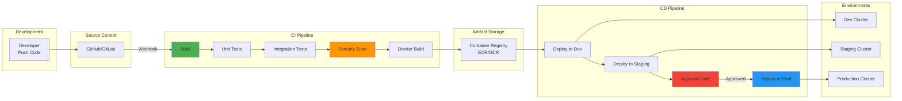

# SpecHire Architecture Diagrams
## Visual Reference for System Components

---

## 1. High-Level System Architecture

---

## 2. Container Architecture

---

## 3. JD Analysis SKILL - Component Diagram

---

## 4. CV Semantic Analysis SKILL - Component Diagram

---

## 5. Data Flow Diagram - JD Creation Workflow

---

## 6. Data Flow Diagram - CV Analysis Workflow

---

## 7. Deployment Architecture - Kubernetes

---

## 8. Security Architecture

```mermaid
graph TB
    subgraph "Security Layers"
        subgraph "Edge Protection"
            A[CloudFlare WAF]
            B[DDoS Protection]
            C[Rate Limiting]
        end
        
        subgraph "Network Security"
            D[VPC]
            E[Private Subnets]
            F[Security Groups]
            G[Network ACLs]
        end
        
        subgraph "Application Security"
            H[API Gateway]
            I[JWT Authentication]
            J[RBAC Authorization]
            K[Input Validation]
        end
        
        subgraph "Data Security"
            L[Encryption at Rest<br/>AES-256]
            M[Encryption in Transit<br/>TLS 1.3]
            N[PII Masking]
            O[Database Encryption]
        end
        
        subgraph "Secrets Management"
            P[HashiCorp Vault]
            Q[AWS Secrets Manager]
            R[Key Rotation]
        end
        
        subgraph "Monitoring & Audit"
            S[CloudWatch Logs]
            T[AWS GuardDuty]
            U[Audit Trail]
            V[SIEM Integration]
        end
    end
    
    A --> D
    B --> D
    C --> D
    D --> E
    E --> F
    F --> H
    G --> H
    H --> I
    I --> J
    J --> K
    K --> L
    L --> M
    M --> N
    N --> O
    O --> P
    P --> Q
    Q --> R
    
    H --> S
    D --> T
    J --> U
    S --> V
    T --> V
    U --> V
    
    style A fill:#F44336
    style I fill:#FF9800
    style L fill:#4CAF50
    style P fill:#2196F3
    style V fill:#9C27B0
```

---

## 9. Monitoring Architecture

---

## 10. CI/CD Pipeline Architecture

---

## Document Information
- **Version:** 1.0
- **Last Updated:** 2026-03-26
- **Format:** Mermaid Diagrams
- **Purpose:** Visual architecture reference
