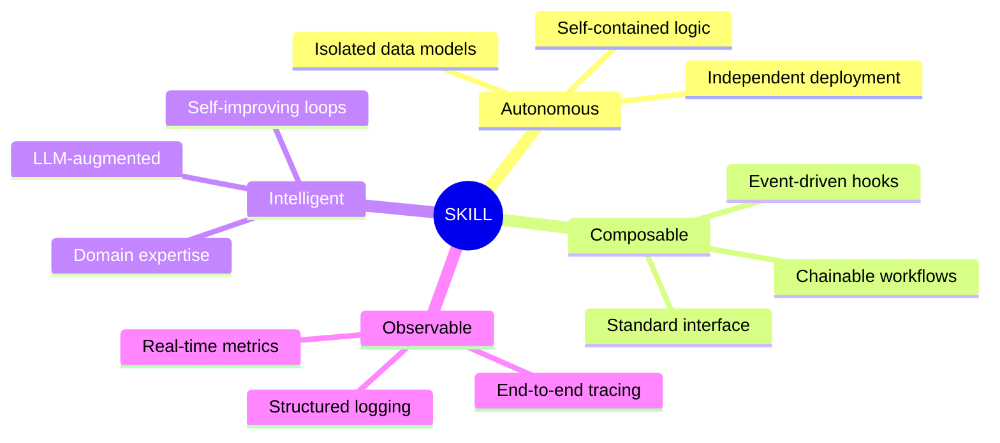
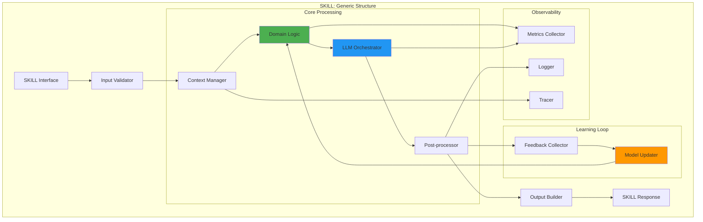

# SKILL Architecture Pattern

## Design Pattern for AI Agent Capabilities

---

## 1. What is a SKILL?

A **SKILL** is a modular, autonomous AI capability that encapsulates specific domain expertise. Think of it as a microservice for AI intelligence.

### 1.1 SKILL Characteristics



### 1.2 SKILL vs Microservice

| Aspect          | Traditional Microservice | SKILL                      |
| --------------- | ------------------------ | -------------------------- |
| **Purpose**     | Business logic           | AI intelligence capability |
| **Interface**   | REST/gRPC API            | Intent-based invocation    |
| **Processing**  | Deterministic            | Non-deterministic (LLM)    |
| **State**       | Stateless or stateful    | Context-aware              |
| **Learning**    | Static logic             | Continuous learning        |
| **Composition** | API orchestration        | Semantic routing           |

---

## 2. SKILL Architecture Pattern

### 2.1 Canonical SKILL Structure



### 2.2 SKILL Interface Contract

Every SKILL must implement this standard interface:

```python
from abc import ABC, abstractmethod
from typing import Dict, Any, List
from dataclasses import dataclass

@dataclass
class SkillMetadata:
    """Metadata describing the SKILL's capabilities"""
    name: str
    version: str
    description: str
    capabilities: List[str]
    input_schema: Dict[str, Any]
    output_schema: Dict[str, Any]
    performance_sla: Dict[str, float]  # e.g., {"latency_p95": 10.0}
    cost_per_invocation: float

@dataclass
class SkillInput:
    """Standard input to any SKILL"""
    data: Dict[str, Any]
    context: Dict[str, Any]
    options: Dict[str, Any]
    trace_id: str

@dataclass
class SkillOutput:
    """Standard output from any SKILL"""
    data: Dict[str, Any]
    metadata: Dict[str, Any]
    status: str  # success | partial | failure
    error: Optional[str]
    trace_id: str

class BaseSkill(ABC):
    """Base class all SKILLs inherit from"""

    @abstractmethod
    def get_metadata(self) -> SkillMetadata:
        """Return SKILL metadata"""
        pass

    @abstractmethod
    async def execute(self, input: SkillInput) -> SkillOutput:
        """Main execution method"""
        pass

    @abstractmethod
    async def validate_input(self, input: SkillInput) -> bool:
        """Validate input against schema"""
        pass

    @abstractmethod
    async def record_feedback(self, output_id: str, feedback: Dict[str, Any]):
        """Record human feedback for learning"""
        pass

    def get_health(self) -> Dict[str, Any]:
        """Health check endpoint"""
        return {
            "status": "healthy",
            "version": self.get_metadata().version
        }
```

---

## 3. JD Analysis SKILL - Implementation

### 3.1 JD SKILL Class Structure

```python
class JDAnalysisSkill(BaseSkill):
    """
    SKILL for Job Description analysis and generation
    """

    def __init__(self, config: Config):
        self.config = config
        self.llm_gateway = LLMGateway(config.llm_config)
        self.document_parser = DocumentParser()
        self.requirement_extractor = RequirementExtractor()
        self.jd_generator = JDGenerator(self.llm_gateway)
        self.intelligence_modules = [
            AttractScorePredictor(),
            RequirementGapDetector(),
            BiasAuditor(),
            SalaryBenchmarker(config.salary_api_key)
        ]
        self.version_manager = VersionManager()
        self.metrics = MetricsCollector()

    def get_metadata(self) -> SkillMetadata:
        return SkillMetadata(
            name="jd_analysis_generation",
            version="1.0.0",
            description="Analyzes requirements and generates professional job descriptions with market intelligence",
            capabilities=[
                "parse_requirement_documents",
                "extract_structured_requirements",
                "generate_jd_draft",
                "calculate_attract_score",
                "detect_requirement_gaps",
                "audit_bias",
                "benchmark_salary"
            ],
            input_schema={
                "type": "object",
                "properties": {
                    "source_type": {"enum": ["document", "form"]},
                    "content": {"type": "object"},
                    "context": {"type": "object"}
                },
                "required": ["source_type", "content"]
            },
            output_schema={
                "type": "object",
                "properties": {
                    "jd_draft": {"type": "object"},
                    "market_intelligence": {"type": "object"},
                    "version_id": {"type": "string"}
                }
            },
            performance_sla={
                "latency_p95": 10.0,  # seconds
                "success_rate": 0.99
            },
            cost_per_invocation=0.50  # USD
        )

    async def execute(self, input: SkillInput) -> SkillOutput:
        """Main execution pipeline"""
        start_time = time.time()
        trace_id = input.trace_id

        try:
            # 1. Parse input
            parsed_doc = await self.document_parser.parse(
                input.data['content'],
                input.data['source_type']
            )

            # 2. Extract requirements
            requirements = await self.requirement_extractor.extract(parsed_doc)

            # 3. Generate JD draft
            jd_draft = await self.jd_generator.generate(
                requirements,
                context=input.context,
                options=input.options
            )

            # 4. Run intelligence analysis (parallel)
            intelligence_tasks = [
                module.analyze(jd_draft, requirements)
                for module in self.intelligence_modules
            ]
            intelligence_results = await asyncio.gather(*intelligence_tasks)

            # 5. Aggregate results
            market_intelligence = self._aggregate_intelligence(intelligence_results)

            # 6. Version management
            version_id = await self.version_manager.create_version(
                jd_draft,
                metadata={"requirements": requirements}
            )

            # 7. Record metrics
            latency = time.time() - start_time
            self.metrics.record_execution(
                skill_name="jd_analysis",
                latency=latency,
                status="success"
            )

            return SkillOutput(
                data={
                    "jd_draft": jd_draft.to_dict(),
                    "market_intelligence": market_intelligence,
                    "version_id": version_id
                },
                metadata={
                    "processing_time_ms": latency * 1000,
                    "model_version": self.llm_gateway.model_version,
                    "generated_at": datetime.now().isoformat()
                },
                status="success",
                error=None,
                trace_id=trace_id
            )

        except Exception as e:
            self.metrics.record_error("jd_analysis", str(e))
            return SkillOutput(
                data={},
                metadata={},
                status="failure",
                error=str(e),
                trace_id=trace_id
            )
```

### 3.2 JD SKILL Deployment

```yaml
# Kubernetes deployment for JD SKILL
apiVersion: apps/v1
kind: Deployment
metadata:
  name: jd-analysis-skill
  labels:
    app: jd-skill
    version: v1.0.0
spec:
  replicas: 3
  selector:
    matchLabels:
      app: jd-skill
  template:
    metadata:
      labels:
        app: jd-skill
        version: v1.0.0
    spec:
      containers:
        - name: jd-skill
          image: spechire/jd-skill:1.0.0
          ports:
            - containerPort: 8080
              name: grpc
            - containerPort: 9090
              name: metrics
          env:
            - name: SKILL_NAME
              value: "jd_analysis_generation"
            - name: SKILL_VERSION
              value: "1.0.0"
            - name: LLM_API_KEY
              valueFrom:
                secretKeyRef:
                  name: llm-secrets
                  key: openai-key
          resources:
            requests:
              memory: "2Gi"
              cpu: "1000m"
            limits:
              memory: "4Gi"
              cpu: "2000m"
          livenessProbe:
            httpGet:
              path: /health
              port: 8080
            initialDelaySeconds: 30
            periodSeconds: 10
          readinessProbe:
            httpGet:
              path: /ready
              port: 8080
            initialDelaySeconds: 10
            periodSeconds: 5
---
apiVersion: v1
kind: Service
metadata:
  name: jd-skill-service
spec:
  selector:
    app: jd-skill
  ports:
    - name: grpc
      port: 8080
      targetPort: 8080
    - name: metrics
      port: 9090
      targetPort: 9090
```

---

## 4. CV Semantic Analysis SKILL - Implementation

### 4.1 CV SKILL Class Structure

```python
class CVSemanticAnalysisSkill(BaseSkill):
    """
    SKILL for semantic CV analysis and scoring
    """

    def __init__(self, config: Config):
        self.config = config
        self.llm_gateway = LLMGateway(config.llm_config)
        self.document_parser = CVDocumentParser()
        self.structure_extractor = CVStructureExtractor()
        self.fingerprinting_engine = DepthFingerprintingEngine(self.llm_gateway)
        self.matching_engine = MatchingEngine()
        self.explainability_engine = WhyRejectedEngine()
        self.blind_spot_detector = BlindSpotDetector()
        self.learning_loop = ClosedLoopLearner()
        self.queue_manager = QueueManager(config.rabbitmq_config)
        self.metrics = MetricsCollector()

    async def execute(self, input: SkillInput) -> SkillOutput:
        """
        Main execution for batch CV analysis
        """
        batch_id = str(uuid.uuid4())
        cvs = input.data['cvs']
        jd_requirements = input.data['jd_requirements']
        config = input.data.get('scoring_config', DEFAULT_CONFIG)

        try:
            # 1. Validate and queue CVs
            await self._queue_cvs_for_processing(batch_id, cvs, jd_requirements, config)

            # 2. Return immediately with batch ID
            # Processing happens asynchronously
            return SkillOutput(
                data={
                    "batch_id": batch_id,
                    "status": "processing",
                    "total_cvs": len(cvs),
                    "estimated_completion_time": len(cvs) * 5  # 5 seconds per CV
                },
                metadata={
                    "processing_mode": "async",
                    "progress_endpoint": f"/api/cv-skill/batch/{batch_id}/progress"
                },
                status="success",
                error=None,
                trace_id=input.trace_id
            )

        except Exception as e:
            return SkillOutput(
                data={},
                metadata={},
                status="failure",
                error=str(e),
                trace_id=input.trace_id
            )

    async def _queue_cvs_for_processing(
        self,
        batch_id: str,
        cvs: List[Dict],
        jd_requirements: Dict,
        config: Dict
    ):
        """Queue CVs for async processing"""
        for cv in cvs:
            task = {
                "batch_id": batch_id,
                "cv_id": cv['cv_id'],
                "cv_file_path": cv['file_path'],
                "jd_requirements": jd_requirements,
                "config": config
            }
            await self.queue_manager.publish("cv_analysis_queue", task)

    async def process_single_cv(self, task: Dict) -> Dict:
        """
        Process a single CV (called by worker)
        """
        start_time = time.time()
        cv_id = task['cv_id']

        try:
            # 1. Parse CV
            parsed_cv = await self.document_parser.parse(task['cv_file_path'])

            # 2. Extract structure
            structured_cv = await self.structure_extractor.extract(parsed_cv)

            # 3. Create depth fingerprint
            fingerprint = await self.fingerprinting_engine.create_fingerprint(
                structured_cv
            )

            # 4. Match against JD
            match_result = await self.matching_engine.match(
                fingerprint,
                task['jd_requirements'],
                task['config']
            )

            # 5. Generate explanation
            explanation = await self.explainability_engine.explain(
                match_result,
                fingerprint,
                task['jd_requirements']
            )

            # 6. Check for blind spots
            blind_spot_alert = await self.blind_spot_detector.detect(
                fingerprint,
                match_result,
                task['jd_requirements']
            )

            # 7. Build result
            result = {
                "cv_id": cv_id,
                "batch_id": task['batch_id'],
                "parsed_cv": structured_cv.to_dict(),
                "technical_fingerprint": fingerprint.to_dict(),
                "matching_score": match_result.total_score,
                "score_breakdown": match_result.breakdown,
                "category": explanation.category,
                "explainability": explanation.to_dict(),
                "blind_spot_alert": blind_spot_alert is not None,
                "processing_time_ms": (time.time() - start_time) * 1000
            }

            # 8. Record metrics
            self.metrics.record_cv_processed(
                score=match_result.total_score,
                category=explanation.category,
                latency=time.time() - start_time
            )

            return result

        except Exception as e:
            self.metrics.record_error("cv_processing", str(e))
            return {
                "cv_id": cv_id,
                "batch_id": task['batch_id'],
                "status": "failed",
                "error": str(e)
            }
```

---

## 5. SKILL Orchestration

### 5.1 SKILL Router

```python
class SkillRouter:
    """
    Routes requests to appropriate SKILLs
    """

    def __init__(self):
        self.skill_registry = SkillRegistry()
        self.load_balancer = SkillLoadBalancer()

    async def route(self, intent: str, input_data: Dict) -> SkillOutput:
        """
        Route based on intent
        """
        # 1. Discover relevant SKILLs
        skills = self.skill_registry.discover(intent)

        if not skills:
            raise SkillNotFoundError(f"No SKILL found for intent: {intent}")

        # 2. Select best SKILL (based on load, cost, SLA)
        selected_skill = self.load_balancer.select(skills)

        # 3. Prepare input
        skill_input = SkillInput(
            data=input_data,
            context={},
            options={},
            trace_id=str(uuid.uuid4())
        )

        # 4. Execute SKILL
        return await selected_skill.execute(skill_input)

class SkillRegistry:
    """
    Registry of all available SKILLs
    """

    def __init__(self):
        self.skills: Dict[str, BaseSkill] = {}

    def register(self, skill: BaseSkill):
        """Register a SKILL"""
        metadata = skill.get_metadata()
        self.skills[metadata.name] = {
            "skill": skill,
            "metadata": metadata,
            "health": skill.get_health()
        }
        logger.info(f"Registered SKILL: {metadata.name} v{metadata.version}")

    def discover(self, query: str) -> List[BaseSkill]:
        """
        Semantic discovery of SKILLs
        """
        matching_skills = []

        for name, skill_info in self.skills.items():
            metadata = skill_info['metadata']

            # Simple keyword matching (can be enhanced with semantic search)
            if any(cap in query.lower() for cap in metadata.capabilities):
                matching_skills.append(skill_info['skill'])

        return matching_skills
```

### 5.2 HR Agent Orchestrator

```python
class HRAgentOrchestrator:
    """
    Main orchestrator that coordinates SKILLs
    """

    def __init__(self):
        self.intent_classifier = IntentClassifier()
        self.context_manager = ContextManager()
        self.skill_router = SkillRouter()
        self.response_formatter = ResponseFormatter()

    async def process(self, user_input: str, session_id: str) -> Dict:
        """
        Main entry point for user interactions
        """
        # 1. Classify intent
        intent = await self.intent_classifier.classify(user_input)

        # 2. Load context
        context = await self.context_manager.get_context(session_id)

        # 3. Prepare input based on intent
        if intent.type == "create_jd":
            input_data = self._prepare_jd_input(user_input, context)
            result = await self.skill_router.route("jd_analysis", input_data)

        elif intent.type == "analyze_cvs":
            input_data = self._prepare_cv_input(user_input, context)
            result = await self.skill_router.route("cv_analysis", input_data)

        else:
            result = await self._handle_other_intent(intent, user_input, context)

        # 4. Update context
        await self.context_manager.update_context(session_id, result)

        # 5. Format response
        response = await self.response_formatter.format(result, intent)

        return response
```

---

## 6. SKILL Best Practices

### 6.1 Design Principles

1. **Single Responsibility**: Each SKILL does ONE thing well
2. **Idempotency**: Same input → Same output (where possible)
3. **Fail Fast**: Validate inputs early, fail gracefully
4. **Observable**: Comprehensive logging and metrics
5. **Versioned**: Clear versioning for backwards compatibility
6. **Testable**: Unit and integration tests for all components

### 6.2 Performance Optimization

```python
# 1. Caching
@cache(ttl=3600)
async def get_jd_requirements(jd_id: str):
    """Cache JD requirements for 1 hour"""
    return await db.query_jd(jd_id)

# 2. Parallel processing
async def process_intelligence_modules(jd_draft):
    """Run all intelligence modules in parallel"""
    tasks = [
        attract_score_predictor.predict(jd_draft),
        gap_detector.detect(jd_draft),
        bias_auditor.audit(jd_draft),
        salary_benchmarker.benchmark(jd_draft)
    ]
    return await asyncio.gather(*tasks)

# 3. Batch processing
async def process_cv_batch(cvs: List[CV]):
    """Process CVs in parallel with limit"""
    semaphore = asyncio.Semaphore(10)  # Max 10 concurrent

    async def process_with_limit(cv):
        async with semaphore:
            return await process_single_cv(cv)

    tasks = [process_with_limit(cv) for cv in cvs]
    return await asyncio.gather(*tasks)
```

### 6.3 Error Handling

```python
class SkillError(Exception):
    """Base exception for SKILL errors"""
    pass

class SkillInputValidationError(SkillError):
    """Input validation failed"""
    pass

class SkillProcessingError(SkillError):
    """Error during processing"""
    pass

class SkillTimeoutError(SkillError):
    """Processing timeout"""
    pass

# Usage
async def execute_with_timeout(skill_input: SkillInput) -> SkillOutput:
    try:
        result = await asyncio.wait_for(
            self._process(skill_input),
            timeout=15.0  # 15 second timeout
        )
        return result
    except asyncio.TimeoutError:
        raise SkillTimeoutError("Processing exceeded 15 seconds")
    except ValidationError as e:
        raise SkillInputValidationError(str(e))
    except Exception as e:
        raise SkillProcessingError(str(e))
```

---

## 7. SKILL Testing Strategy

### 7.1 Unit Testing

```python
import pytest
from unittest.mock import Mock, AsyncMock

@pytest.fixture
def jd_skill():
    return JDAnalysisSkill(test_config)

@pytest.mark.asyncio
async def test_jd_generation(jd_skill):
    """Test JD generation"""
    skill_input = SkillInput(
        data={
            "source_type": "form",
            "content": {
                "role": "Senior Backend Engineer",
                "requirements": ["Python", "AWS", "5+ years"]
            }
        },
        context={},
        options={},
        trace_id="test-123"
    )

    result = await jd_skill.execute(skill_input)

    assert result.status == "success"
    assert "jd_draft" in result.data
    assert result.data['jd_draft']['job_title'] == "Senior Backend Engineer"

@pytest.mark.asyncio
async def test_bias_detection(jd_skill):
    """Test bias detection"""
    jd_text = "Looking for young, energetic rockstar developer"

    result = await jd_skill.intelligence_modules[2].audit(jd_text)

    assert len(result.alerts) >= 1
    assert any(alert.type == "age_discrimination" for alert in result.alerts)
```

### 7.2 Integration Testing

```python
@pytest.mark.integration
async def test_end_to_end_jd_workflow():
    """Test complete JD workflow"""
    orchestrator = HRAgentOrchestrator()

    # 1. Create JD
    result = await orchestrator.process(
        "Create a JD for Senior Python Developer",
        session_id="test-session"
    )

    assert "jd_draft" in result
    jd_id = result['jd_id']

    # 2. Analyze CVs
    result = await orchestrator.process(
        f"Analyze these CVs for JD {jd_id}",
        session_id="test-session"
    )

    assert "batch_id" in result
    assert result['status'] == "processing"
```

---

## Document Information

- **Version:** 1.0
- **Last Updated:** 2026-03-26
- **Purpose:** SKILL architecture pattern and implementation guide
